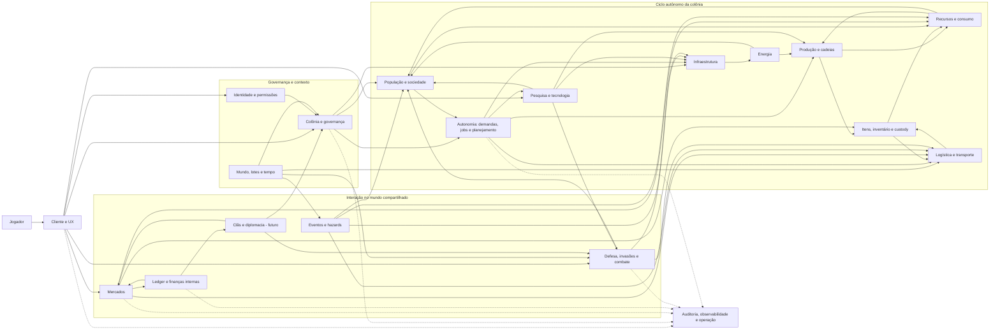

# Frontier — Discovery do Produto

**Status:** rascunho para revisão humana  
**Versão:** v0.4  
**Escopo:** descoberta do produto e dos domínios conceituais  
**Fora do escopo:** implementação, escolha final de tecnologias, contratos de API e schema de banco

## Como ler este documento

- **§1–7** descrevem visão, pilares e o mapa conceitual do produto.
- **§8** é o registro único de decisões confirmadas. Se algo aqui contradizer outra seção, esta seção prevalece.
- **§9** explica conceitos usados nas decisões.
- **§10** reúne propostas de design aprovadas como direção, mas ainda sem números.
- **§11** é a lista única de questões em aberto.
- **§12** define o recorte e o próximo passo.

## 1. Leitura executiva

Frontier é um jogo multiplayer persistente de colonização em um mundo compartilhado. O jogador não deve operar cada colono individualmente; ele define intenções, restrições e políticas, enquanto a colônia deriva prioridades e converte essas decisões em trabalho, produção, logística, pesquisa, comércio e defesa.

O diferencial pretendido não é apenas ter muitos sistemas, mas fazer com que eles formem uma cadeia causal legível:

```text
decisão do jogador
→ plano e prioridades da colônia
→ demandas e jobs
→ ação de colonos e infraestrutura
→ transformação física de recursos, pessoas e território
→ economia, riscos e eventos
→ novas decisões do jogador
```

O risco principal nesta fase é confundir profundidade com quantidade de features. O produto precisa primeiro provar um ciclo pequeno, coerente e compreensível, antes de assumir mercado entre jogadores, invasões completas e simulação detalhada de cada indivíduo.

## 2. Product Vision proposta

> **Frontier é um simulador multiplayer persistente de colonização em que o jogador governa uma sociedade emergente por meio de objetivos, políticas e estratégia — e não por microgerenciamento. Cada recurso, relacionamento, rota e conflito deixa consequências no mundo compartilhado, permitindo que colônias se especializem, cooperem, negociem e disputem seu futuro.**

### 2.1 Promessa ao jogador

O jogador deve sentir que:

- suas decisões estratégicas alteram o comportamento coletivo da colônia;
- os colonos são agentes com história e capacidade de agir, não apenas números de produção;
- produção e comércio têm geografia, dependências e riscos reais;
- o mundo continua evoluindo sem exigir presença constante;
- problemas podem ser entendidos e resolvidos por meio de políticas e prioridades;
- histórias emergentes surgem da interação entre pessoas, recursos, instituições e eventos.

### 2.2 O que Frontier não pretende ser, por enquanto

- um city builder puramente manual;
- um jogo de cliques por colono ou por receita;
- um mercado abstrato em que toda mercadoria teleporta;
- um combate resolvido apenas por um valor de poder;
- um produto de dinheiro real ou uma economia financeira real para jogadores;
- uma demonstração de tecnologias distribuídas sem necessidade de produto.

## 3. Game Pillars

### Pilar 1 — Governança por intenção

O jogador define metas, políticas, orçamento, expansão, pesquisa e doutrina. A colônia deriva prioridades e decide como executar dentro dessas regras.

**Critério de sucesso:** uma decisão de alto nível deve gerar consequências operacionais observáveis sem exigir que o jogador atribua manualmente cada tarefa.

**Risco:** autonomia imprevisível ou pouco legível pode parecer incompetência do sistema. Toda ação importante precisa ter motivo, custo, prioridade e resultado explicáveis.

### Pilar 2 — Pessoas com agência e memória

Cada colono é uma entidade individual com competências, necessidades, saúde, relações, experiência, lealdade e histórico. A população deve produzir histórias e restrições reais para a colônia.

**Critério de sucesso:** substituir ou perder um colono relevante muda possibilidades da colônia, mas não torna o jogo arbitrariamente impossível.

**Risco:** simular detalhes individuais demais pode destruir performance e clareza. A fidelidade precisa ser graduada por relevância.

### Pilar 3 — Causalidade material e logística

Recursos, itens e pessoas ocupam localizações e percorrem rotas. Capacidade, distância, energia, armazenamento e risco devem limitar decisões econômicas.

**Critério de sucesso:** uma escassez ou atraso pode ser rastreado até a cadeia que o causou e pode ser mitigado por decisões alternativas.

**Risco:** deslocamento excessivamente lento ou burocrático pode transformar o jogo em uma tela de espera — risco ampliado pelo tempo 1:1 com o real (§8.3).

### Pilar 4 — Economia emergente entre jogadores

Colônias podem se especializar, negociar, competir e, no futuro, formar instituições. Preços e oportunidades devem refletir oferta, demanda, região, custos e risco.

**Critério de sucesso:** jogadores diferentes podem prosperar por estratégias econômicas distintas, sem que uma única cadeia domine todo o mundo.

**Risco:** mercados sem liquidez, manipulação ou vantagem de jogadores antigos podem inviabilizar a experiência de entrada.

### Pilar 5 — Mundo persistente com risco administrável

O mundo continua evoluindo, mas o jogador offline não deve ser destruído por uma janela curta de ausência. Conflitos precisam criar decisões e consequências, não apenas punição irreversível.

**Critério de sucesso:** ausência gera exposição e escolhas de preparação, mas não exige vigilância contínua.

**Risco:** proteger demais o jogador elimina o significado da invasão e da logística.

### Pilar 6 — Sistemas legíveis e consequência explicável

Profundidade só é útil se o jogador consegue entender estado, causa, previsão, falha e alternativa. Painéis, alertas, histórico e visualizações são parte da fantasia de governar.

**Critério de sucesso:** diante de um problema, o jogador consegue responder “o que aconteceu, por quê e qual decisão posso tomar?”.

## 4. Modelo conceitual do produto

| Entidade | Papel no produto |
| --- | --- |
| Jogador | Define intenção e controla exatamente uma colônia |
| Colônia | Unidade política e operacional principal; ocupa um lote no mundo |
| Colono | Agente individual que executa trabalho, forma relações e sofre consequências |
| Infraestrutura | Capacidade material que transforma, armazena, transporta ou protege |
| Recurso | Material fungível usado por consumo, produção, comércio e construção |
| Item | Objeto individual com identidade, estado, qualidade e localização |
| Pesquisa | Conhecimento acumulado que desbloqueia capacidades |
| Rota/Transporte | Movimento físico de recursos, itens ou colonos |
| Lote de colônia | Área do tamanho de um mapa de *RimWorld* ocupada por uma colônia |
| Espaço de conexão | Área do mundo que liga lotes e define distância entre colônias |
| Ordem/Contrato | Compromisso econômico ou de transferência entre participantes |
| Instituição | Clã formado por jogadores (fora da v1) |
| Evento | Mudança temporal ou externa que cria risco, oportunidade ou perturbação |

## 5. Mapa de domínios e sistemas

### 5.1 Identidade, conta e governança

- identidade, autenticação e autorização;
- perfil do jogador;
- ownership da colônia e dos ativos;
- permissões dentro da colônia e, futuramente, de clãs;
- políticas, prioridades, metas e orçamento;
- notificações, relatórios e histórico de decisões.

### 5.2 Mundo e tempo

- geração e configuração do mundo;
- lotes de colônia, espaços de conexão e posicionamento;
- biomas, recursos, clima e hazards;
- topologia, distância e adjacência entre colônias;
- tempo contínuo 1:1 com o real e simulação offline;
- ciclo dia/noite;
- eventos regionais e globais.

### 5.3 Colônia e infraestrutura

- fundação da colônia no lote atribuído;
- zonas e ocupação do território;
- prédios, módulos, upgrades e manutenção;
- armazenamento e capacidade;
- energia e redes;
- integridade, danos, reparo e desativação.

### 5.4 População e sociedade

- colonos individuais;
- necessidades, saúde, idade e mortalidade;
- skills, experiência, traits e especializações;
- relações, família, reprodução e dependentes;
- lealdade, moral, cultura e qualidade de vida;
- imigração, contratos e transferência temporária;
- substituição de agentes, automatização e drones.

### 5.5 Autonomia e execução

- estado observado da colônia;
- sistema de demanda e déficit;
- objetivos e prioridades;
- jobs, reservas e alocação de agentes;
- seleção por capacidade, distância, risco e utility;
- planejamento de tarefas compostas;
- execução, interrupção, replanejamento e feedback;
- explicação de decisões e causas de não execução.

### 5.6 Recursos, produção e consumo

- catálogo de recursos, receitas e produtos;
- extração;
- agricultura, pecuária e alimentos;
- indústria, refino e componentes;
- consumo da população e da infraestrutura;
- qualidade, perdas, resíduos e transformação;
- capacidade produtiva, gargalos e manutenção.

### 5.7 Itens e inventário

- itens únicos e itens fungíveis;
- localização, owner e cadeia de custódia;
- reserva, equipamento, transferência e descarte;
- durabilidade, qualidade, modifiers e dano;
- estados exclusivos como `STORED`, `EQUIPPED`, `RESERVED`, `IN_TRANSIT`, `DROPPED`, `DAMAGED` e `DESTROYED`;
- concorrência e prevenção de duplicação.

### 5.8 Logística e transporte

- warehouses, depósitos e nós logísticos;
- capacidade, rotas, distância e tempo;
- filas, priorização e consolidação de carga;
- transporte de recursos, itens e colonos;
- risco, interceptação, perda, atraso e seguro;
- entrega, recebimento e reconciliação.

### 5.9 Pesquisa e tecnologia

Sistema essencial do produto e parte do núcleo jogável (§8.10).

- laboratórios e capacidade de pesquisa;
- árvore ou rede tecnológica;
- pesquisas assíncronas em tempo real;
- especializações e pré-requisitos;
- influência de colonos, instituições e descobertas;
- desbloqueios que alteram produção, logística, sociedade ou defesa.

### 5.10 Economia e mercados

- mercado NPC de último recurso;
- resource market por quantidade;
- item market por objeto individual;
- contratos de colonos;
- buy orders, sell orders, matching e liquidação;
- preços, taxas e custos de transporte;
- escrow, propostas privadas e trocas;
- proteção contra abuso e regras de cancelamento.

### 5.11 Sistema financeiro

- wallets e contas contábeis;
- ledger de partidas dobradas;
- débito, crédito e reserva;
- escrow, capture, refund e reconciliação;
- idempotência e audit log;
- separação explícita entre moeda do jogo e dinheiro real;
- insolvência e limites, se existirem.

### 5.12 Clãs e diplomacia (fora da v1)

- clãs formados por jogadores;
- membros, papéis e permissões;
- recursos e infraestrutura compartilhados;
- acordos, tarifas e acesso;
- reputação, confiança, sanções e relações;
- projetos coletivos e governança interna.

### 5.13 Defesa, invasão e combate

- segurança da colônia;
- ameaças, alertas e preparação;
- doutrina e objetivos definidos pelo jogador;
- squads, equipamentos, terreno, cover e movimento;
- skill, moral, fadiga, ferimentos, retirada, rendição e captura;
- ataque a infraestrutura, roubo, sabotagem, espionagem e interceptação;
- regras de proteção offline e recuperação pós-conflito.

### 5.14 Cliente, apresentação e confiança do jogador

- dashboard estratégico;
- mapa e representação espacial;
- timeline e replay de eventos;
- inspeção de colônia, colono, cadeia produtiva e transporte;
- alertas priorizados;
- explicações de decisão da autonomia;
- ações em lote e edição de políticas;
- acessibilidade, localização e tolerância a reconexão.

### 5.15 Capacidades transversais

- versionamento de regras e conteúdo;
- auditoria e histórico;
- observabilidade técnica e métricas de negócio;
- administração, suporte e ferramentas de operação;
- moderação, anti-cheat e segurança;
- backup, restauração, migração e recuperação de desastre;
- testes determinísticos, replay e diagnóstico de simulação.

## 6. Dependências conceituais

O sistema não deve ser implementado na ordem da lista de features. A dependência conceitual mais importante é:

1. identidade, ownership, tempo e mundo fornecem o contexto;
2. colônia, população, infraestrutura e recursos formam o estado material;
3. demanda, jobs e autonomia transformam intenção em ação;
4. produção, inventário, energia e logística transformam e movimentam valor;
5. pesquisa aumenta possibilidades;
6. mercados, finanças e contratos conectam colônias;
7. clãs, diplomacia e combate disputam acesso, território e valor;
8. cliente, auditoria e observabilidade tornam tudo operável e compreensível.

### 6.1 Dependências mais sensíveis

| Dependência | Por que é crítica |
| --- | --- |
| Tempo → todos os sistemas | Define durações, atrasos, cooldowns, crescimento, combate e processamento offline |
| Ownership → todos os estados relevantes | Impede dois subsistemas de alterarem a mesma verdade sem coordenação |
| Localização → recursos, itens, pessoas e dinheiro | Determina logística, risco, posse e resolução de transações |
| Topologia → logística, mercado e invasão | Distância entre lotes define custo, tempo e alcance |
| Demanda → jobs → execução | É o núcleo da promessa de autonomia |
| Reserva → inventário, produção, transporte e finanças | Evita dupla alocação de bens, capacidade ou fundos |
| Estado de infraestrutura → produção e energia | Conecta falhas físicas a consequências econômicas |
| Pesquisa → produção, infraestrutura e defesa | Controla quais capacidades existem em cada colônia |
| Ledger → mercados e contratos | Torna pagamentos auditáveis e recuperáveis após falhas |
| Regras de offline → invasões e eventos | Define se persistência é interessante ou injusta |
| Explicabilidade → UX e autonomia | Sem ela o jogador não consegue governar sistemas autônomos |

## 7. Funcionalidades importantes ainda não explicitadas

Estas funcionalidades provavelmente serão necessárias para o produto ser jogável e operável, embora não sejam o foco da fantasia principal:

### Experiência do jogador

- onboarding e primeira colônia guiada;
- objetivos iniciais e curva de complexidade;
- presets de política e automação gradual;
- planejamento antecipado de ações, já que não há pause nem aceleração;
- desfazer/cancelar com regras claras;
- comparação entre previsão e resultado;
- busca, filtros e navegação entre causas e efeitos;
- resumos para jogador offline.

### Persistência e continuidade

- retomada após desconexão;
- cálculo de eventos durante ausência;
- limites de processamento por colônia e por região;
- salvamento consistente e recuperação;
- replay determinístico para suporte e disputas;
- política de morte, abandono, inatividade e transferência de conta.

### Mundo e conteúdo

- geração do mundo, dos lotes e dos espaços de conexão;
- distribuição e renovação de recursos;
- clima, estação, desastres e mudanças ambientais;
- fauna;
- raridade, descoberta, exploração e informação incompleta;
- marcos de longo prazo compatíveis com sucesso relativo.

### Economia e segurança

- criação e destruição de moeda;
- inflação, sinks, taxas e emissão;
- prevenção de multi-accounting, bots, lavagem e manipulação de mercado;
- limites de crédito e falência;
- disputa de transação e atendimento ao jogador;
- regras para presentes, empréstimos, herança e transferência entre contas;
- separação entre recursos obtidos no jogo e qualquer pagamento real.

### Conflito e sociedade

- proteção para iniciantes;
- custo de agressão;
- seguros, recuperação e reconstrução;
- captura, resgate, deserção e tratamento de prisioneiros;
- reputação e consequências diplomáticas;
- sucessão e perda de liderança;
- moderação de nomes, mensagens e comportamento abusivo.

### Operação e qualidade

- painel administrativo;
- métricas de saúde e métricas de economia;
- feature flags e rollout de regras;
- compatibilidade de versões de simulação;
- ferramentas de inspeção sem alterar o estado;
- manutenção planejada, incidentes e comunicação de mudanças;
- matriz de testes de estado, concorrência, falha e carga.

## 8. Decisões confirmadas

“Confirmado” significa intenção atual do produto. Números marcados como provisórios ainda serão balanceados.

### 8.1 Direção do produto

Prioridade da experiência principal:

1. governar uma colônia;
2. competir por poder;
3. construir uma economia;
4. contar histórias de colonos.

Não haverá uma condição única de vitória. Colônias poderão buscar papéis diferentes, como exportar soldados, fornecer comida, produzir armas ou especializar-se em outros setores. O sucesso é relativo e baseado em estratégia, reputação, influência e especialização.

**Implicação:** “poder” não deve ser apenas força militar. Pode combinar capacidade produtiva, influência, logística, tecnologia e defesa. Um ranking único de poder provavelmente reduziria a variedade desejada.

### 8.2 Ritmo de participação

- organização mínima da colônia em até aproximadamente 40 minutos por dia;
- possibilidade de jogar adequadamente entrando pelo menos 3 vezes por semana;
- jogadores que desejarem competir por poder podem investir mais tempo e atenção;
- a colônia continua funcionando sem o jogador;
- decisões críticas, como iniciar uma invasão, não são tomadas automaticamente;
- comércio automático só poderá acontecer no futuro, por rotas comerciais previamente configuradas.

**Consequência de design:** o jogo precisa privilegiar planejamento, filas, políticas, alertas e relatórios. Não pode depender de reação em tempo real ou de presença contínua para evitar uma catástrofe.

### 8.3 Tempo

- relógio global contínuo, **1:1 com o tempo real**: um dia no jogo dura 24 horas reais;
- velocidade fixa, sem pause ou aceleração por jogador;
- ações possuem duração real;
- decisões críticas ficam pendentes até o jogador ou uma política autorizada resolvê-las;
- relatórios resumem o que ocorreu desde o último acesso.

O tamanho dos ciclos internos de processamento é uma decisão técnica posterior. Para o jogador, o tempo é contínuo e observável; “tick interno” não aparece como pausa ou aceleração.

As consequências dessa escolha estão em §11.2.

### 8.4 Mundo e topologia

- mundo persistente, sem reset ou temporadas por enquanto;
- cada colônia ocupa um **lote** do tamanho aproximado de um mapa de *RimWorld*; o mundo inteiro é muito maior que um lote;
- lotes são ligados por **espaços de conexão**; a distância entre colônias é física e real;
- o posicionamento é semialeatório dentro do espaço do mundo: uma colônia pode ficar perto de algumas e longe de outras;
- capacidade provisória de **aproximadamente 5.000 colônias por mundo**;
- alcance, escolha de alvos e distância de invasão dependem da posição física, não de matchmaking abstrato.

### 8.5 Escala

| Dimensão | Direção atual |
| --- | --- |
| Colônia | Uma única colônia por jogador; prédios limitados pelo território do lote |
| População | Normalmente até aproximadamente 40 colonos; limite absoluto de 100 |
| Lote | Aproximadamente o tamanho de um mapa de *RimWorld* |
| Mundo | Aproximadamente 5.000 lotes ligados por espaços de conexão |
| Simulação | 3 colonos no início, com crescimento gradual; simulação contínua mesmo offline |

Frontier deve otimizar a profundidade de uma colônia pequena/média, e não simular milhares de colonos por jogador. Ainda assim, o mundo inteiro pode chegar a centenas de milhares de colonos simulados continuamente (5.000 × até 100). Esses limites precisam ser validados com testes de jogabilidade e performance.

### 8.6 População

- cada nova colônia começa com 3 colonos básicos gerados aleatoriamente;
- a geração deve garantir capacidade mínima para iniciar: obter alimento, água, abrigo e manutenção básica;
- nenhum colono inicial pode nascer com condição que impeça o começo;
- população cresce por reprodução;
- satisfação alta pode gerar imigração espontânea;
- o território limita prédios; não há limite artificial fixo de quantidade de prédios.

### 8.7 NPCs, fauna e clãs

- **não haverá NPCs agindo no mundo** (colonos, colônias ou facções controlados pelo sistema);
- existem apenas **NPCs de sistema**, que funcionam como serviços sem presença física: o mercado de último recurso (§10.2) e o vendedor de proteção PvP (§8.9);
- fauna pode existir;
- não haverá corporações nem clãs na v1; clãs formados por jogadores podem ser adicionados depois.

### 8.8 Saúde e mortalidade

O modelo desejado é de mortalidade indireta e consequência persistente, não de morte frequente como em *RimWorld*.

- invasões recebidas e invasões malsucedidas podem causar condições: lesões, doenças ou cicatrizes;
- condições não tratadas podem piorar e gerar debuffs;
- tratamento pode reduzir ou recuperar condições;
- **três condições graves simultâneas causam a morte** do colono; não é um contador irreversível ao longo da vida.

Terminologia adotada:

- **temporária:** desaparece com tempo ou tratamento;
- **persistente:** pode ser tratada e reduzida, mas deixa risco ou sequela;
- **grave:** estágio que ocupa capacidade de saúde e conta para mortalidade;
- **fatal:** estado terminal quando a regra de mortalidade é atingida.

### 8.9 PvP — regras gerais

O modelo de invasão está em §8.14; números e detalhes seguem abertos em §11.1.

- PvP é opcional; uma colônia precisa estar aberta a invasões para poder invadir outras;
- invasões são preparadas e avisadas com antecedência, e o defensor tem tempo real para se preparar;
- uma derrota não elimina a colônia nem transfere sua propriedade;
- uma fábrica pode parar por falta de recursos, mas a colônia não é apagada;
- o atacante pode escolher o que tenta roubar;
- o defensor pode manter um estoque seguro, limitado por peso e por tipos de itens;
- combate é essencial ao produto, mas não pode permitir snowball ou griefing sem contramedidas;
- proteção inicial gratuita de 7 dias; depois, proteção pode ser comprada do NPC de sistema com créditos;
- proteção paga deve ser interessante para colônias lucrativas e pouco militares, como fazendas;
- a proteção pode ser desativada permanentemente.

**Modelo base aprovado:** três estados de PvP por colônia.

- `PROTECTED`: não pode iniciar nem receber invasões; possui limitações para competir por certos benefícios de guerra;
- `OPEN`: pode iniciar e receber invasões; a troca para este estado tem cooldown e não pode ser usada para escapar de uma guerra;
- `ENGAGED`: está em uma invasão declarada e permanece vulnerável até o encerramento da operação.

### 8.10 Pesquisa

- pesquisa e tecnologia são **essenciais** e fazem parte do núcleo jogável;
- o ciclo mínimo jogável (§10.5) inclui pelo menos uma pesquisa básica que altera a colônia.

### 8.11 Contratos de colonos

- contratos fazem parte da **v1 do produto**, mas não do primeiro ciclo jogável;
- um contrato é um acordo de trabalho, serviço, empréstimo ou transferência temporária entre colônias, não a venda de uma pessoa;
- reprodução e imigração continuam sendo as formas de crescimento populacional.

### 8.12 Combate

- o combate é modelado como confronto entre `CombatEntity`, e não como regra especial de “colônia contra colônia”;
- a invasão termina quando os combatentes designados são derrotados e os sistemas de segurança são desativados.

### 8.13 Localização e custody

Localização e custody devem ser informados explicitamente em tempo real. Recursos fungíveis podem ser agregados por estoque quando isso não esconder a posição relevante; itens únicos, colonos e carregamentos precisam de rastreamento individual.

### 8.14 Modelo de invasão

A proposta inicial de uma janela fixa de 5 dias foi descartada: nenhuma janela fixa garante que um jogador que entra 3 vezes por semana veja o aviso, e uma janela longa esfria o conflito e permite esconder o saque. O modelo aprovado combina quatro regras:

1. **Aviso pela distância física:** o tempo de deslocamento do atacante pelos espaços de conexão é o aviso, com um piso mínimo. Ataques distantes são mais lentos e caros.
2. **Horário de vulnerabilidade:** ao entrar em `OPEN`, a colônia define um horário diário em que combates podem acontecer. A chegada do atacante é ajustada para esse horário.
3. **Doutrina de defesa obrigatória:** só pode ficar em `OPEN` a colônia com doutrina de defesa configurada, executada automaticamente quando o defensor está offline.
4. **Alvos de saque fixados na declaração:** o que o atacante escolheu tentar roubar fica registrado no momento da declaração.

Aviso típico esperado: entre 1 e 3 dias. Sequência:

```text
declaração (alvos fixados) → deslocamento pelos espaços de conexão
→ chegada no horário de vulnerabilidade → combate (doutrina se offline)
→ breach/defesa → saque limitado ou falha → recuperação e cooldown
```

## 9. Conceitos de referência

### 9.1 Explicabilidade da autonomia

É o sistema mostrar por que algo aconteceu. Exemplos:

- “A demanda de comida subiu porque a população cresceu e o estoque caiu.”
- “O job não foi atribuído porque não existe colono disponível com a skill necessária.”
- “A fábrica parou porque o estoque de cobre reservado foi enviado para outra ordem.”
- “O colono escolheu reparar a bomba antes de extrair pedra porque a política de sobrevivência tem prioridade maior.”

Isso não exige mostrar cálculo técnico interno; exige uma explicação útil para o jogador investigar e decidir.

### 9.2 Qualidade da autonomia

É definir o que o sistema prioriza quando não consegue fazer tudo ao mesmo tempo. Proposta mantida:

1. sobrevivência e segurança;
2. necessidades básicas;
3. estabilidade da infraestrutura;
4. políticas e metas do jogador;
5. eficiência e lucro;
6. conveniência ou melhoria de longo prazo.

Políticas do jogador definem prioridades por setor e contexto dentro de limites seguros. A ordenação operacional final é derivada pelo sistema depois do inventário de interações.

### 9.3 Precisão de localização

- minério fungível pode ser controlado como “500 ferro no armazém A”;
- uma arma única precisa ter localização e identidade próprias;
- um colono precisa existir em uma localização exata ou em trânsito;
- um carregamento precisa indicar origem, destino e rota.

A definição do nível exato de precisão será um dos maiores desafios técnicos do projeto.

### 9.4 Ownership, custody e reservation

Ownership é quem tem o direito sobre o ativo. Custody é quem o guarda ou transporta. Reservation é quem tem aquele ativo separado para uma operação.

Exemplo de venda:

```text
ferro pertence ao vendedor
→ ferro é reservado para uma ordem
→ transportador recebe a custody
→ comprador recebe ownership na entrega confirmada
```

Para dinheiro:

```text
créditos pertencem ao comprador
→ ficam reservados
→ entram em escrow
→ vendedor recebe após entrega
→ refund ocorre se a operação for cancelada segundo a regra
```

Essa separação evita que “estar dentro de uma fábrica”, “estar em uma carroça” ou “estar reservado” crie duplicação ou transferência indevida.

### 9.5 Clãs e ownership coletivo

Clãs seriam organizações criadas por jogadores, equivalentes a guildas ou companhias, com membros, cargos, tesouraria, instalações compartilhadas, contratos, projetos e relações diplomáticas. Não fazem parte da v1, mas a arquitetura de combate não deve assumir que toda unidade de combate é uma colônia (§10.4).

### 9.6 Autoridade única sobre estado

Produção, inventário, logística, colonos e energia atravessam simulação e economia. Cada agregado mutável deve ter uma única autoridade; outros componentes publicam comandos ou recebem snapshots/eventos. Cálculo paralelo não deve significar dupla escrita concorrente. A escolha de linguagens e runtimes fica para o Macro System Design.

## 10. Propostas de design aprovadas como direção

### 10.1 Economia e finanças em camadas

#### Camada 1 — crédito interno e NPC de último recurso

- uma moeda interna chamada provisoriamente `credits`;
- carteira da colônia registrada em ledger;
- crédito inicial para fundar a colônia;
- NPC de sistema compra recursos por preço baixo e vende por preço alto;
- compras e vendas do NPC têm limites ou preço variável para não criar dinheiro infinito;
- sinks iniciais: construção, manutenção, transporte, reparos, taxas de mercado e proteção contra PvP;
- nenhum dinheiro real e nenhum saque financeiro entre jogadores.

#### Camada 2 — mercado de jogadores

- ordens de compra e venda no estilo Bazaar;
- créditos e mercadorias reservados enquanto a ordem estiver ativa;
- ordem combinada não entrega instantaneamente: gera uma obrigação de transporte;
- o vendedor mantém ownership até a entrega confirmada;
- o comprador mantém os créditos em escrow até a liquidação;
- cancelamento, falha, atraso e reembolso têm estados explícitos;
- taxa cobrada apenas em eventos definidos, para não esconder o custo real.

#### Camada 3 — contratos de colonos

- contrato com origem, destino, função, duração, pagamento e condições de retorno;
- salário e custos de transporte passam pelo ledger;
- o colono continua sendo uma entidade individual rastreável;
- família, consentimento, deserção, doença e encerramento antecipado precisam de regras próprias;
- contratos não transferem a propriedade da pessoa.

#### Camada 4 — crédito avançado

Crédito, empréstimos e garantias só entram se houver necessidade clara de gameplay. Escrow e reconciliação são necessários para o mercado; crédito bancário não é necessário para provar o primeiro ciclo.

### 10.2 Mercado inspirado no Bazaar

- ordem de compra com preço e quantidade;
- ordem de venda com preço e quantidade;
- compra/venda imediata contra ordens existentes;
- saldo e mercadoria reservados enquanto a ordem está ativa;
- taxa de operação e regras de cancelamento;
- histórico de preço e volume;
- mercados regionais, quando a logística física estiver pronta.

O NPC de sistema é comprador e vendedor de último recurso: mantém a colônia operando quando não há contraparte, sem ser a opção economicamente mais eficiente. O Bazaar de jogadores continua sendo o mercado preferencial.

### 10.3 Anti-snowball e proteção contra abuso

“Snowball” significa que quem está na frente acumula tanta força, território e recursos que os demais deixam de ter resposta possível. Direção aprovada:

- proteção inicial para colônias novas;
- invasões com declaração, custo e tempo de preparação;
- limite de dano e de saque por operação;
- estoque seguro limitado, nunca invulnerabilidade total;
- custos logísticos crescentes para operações distantes;
- recuperação e reconstrução após derrota;
- mais de um eixo de poder: comida, tecnologia, defesa, logística ou comércio;
- nenhuma transferência instantânea da propriedade da colônia.

### 10.4 Arquitetura conceitual de combate

Uma `CombatEntity` pode ser composta por:

- colonos da própria colônia;
- reforços contratados ou aliados;
- unidades de defesa;
- drones, fauna ou outras entidades combatentes futuras.

Isso permite batalhas com diferentes reforços sem depender do futuro sistema de clãs. Clãs podem ser adicionados depois como origem de reforços, ownership ou comando coletivo.

### 10.5 Menor ciclo jogável

```text
3 colonos aleatórios válidos
→ necessidades de água/comida/abrigo
→ prioridades do jogador
→ demandas e jobs autônomos
→ extração e produção simples
→ armazenamento e consumo
→ energia e manutenção básica
→ pesquisa básica que desbloqueia uma melhoria
→ fauna/hazard ou incidente local
→ preparação de defesa
→ relatório de consequências
```

Esse recorte responde se Frontier é divertido como colônia governada antes de adicionar mercado entre jogadores, contratos e invasões completas.

### 10.6 Processo para decidir a autonomia

1. listar todas as interações do jogador, da colônia, dos colonos, da infraestrutura, da pesquisa, do mercado e do combate;
2. para cada interação, identificar quem pode iniciar, cancelar, alterar e concluir;
3. classificar cada ação como **automática**, **manual**, **híbrida**, **sugestão** ou **crítica**;
4. definir o que acontece quando o jogador não responde;
5. definir a prioridade quando duas ações competem;
6. simular uma semana de jogo com apenas 40 minutos de organização diária;
7. revisar se a autonomia cria decisões estratégicas ou apenas corrige falhas irritantes.

Esse inventário vem antes da escolha entre Utility AI, GOAP, HTN ou qualquer técnica. O inventário está em [interaction-inventory.md](./interaction-inventory.md).

## 11. Questões em aberto

### 11.1 Números e detalhes de invasão

O modelo de invasão está aprovado em §8.14. Seguem abertos:

- piso mínimo do aviso e velocidade de deslocamento pelos espaços de conexão;
- duração mínima e máxima do horário de vulnerabilidade e cooldown para alterá-lo;
- conteúdo mínimo obrigatório de uma doutrina de defesa;
- custo de proteção após os 7 dias, duração das proteções pagas e cooldowns de ativação/desativação;
- alvos permitidos, limites de saque e destruição permanente;
- o que acontece com recursos vendidos ou consumidos durante o aviso que estavam entre os alvos fixados.

### 11.2 Consequências do tempo 1:1

- **Durações de ações:** construções, receitas, viagens, pesquisas e tratamentos precisam de durações em horas/minutos reais compatíveis com 40 min/dia e 3 acessos por semana.
- **Processos biológicos:** gestação, crescimento, envelhecimento e cura não podem seguir o calendário real (um ano de idade por ano real). Precisam de escala própria.
- **Dia/noite e fusos horários:** com um relógio global, jogadores em fusos diferentes veem a colônia sempre no mesmo período (por exemplo, sempre de noite). É preciso decidir se o dia/noite é global, por posição no mundo ou desacoplado.
- **Estações e clima:** um ano real por ciclo de estações pode ser lento demais para gerar variação perceptível.
- **Ritmo logístico:** transporte físico entre lotes em tempo real pode deixar o comércio lento demais (Pilar 3).

### 11.3 Topologia do mundo

- como os espaços de conexão são representados: grafo de rotas, grade contínua ou zonas;
- se os espaços de conexão têm recursos, fauna, hazards ou exploração próprios;
- se o jogador escolhe a região do lote ou recebe um lote aleatório;
- se uma colônia pode se mudar de lote;
- o que acontece com o lote de uma colônia abandonada ou inativa;
- densidade de vizinhos e equilíbrio entre colônias próximas e isoladas;
- como o mundo cresce ou é particionado quando os 5.000 lotes forem ocupados.

### 11.4 Autonomia versus controle direto

Quais interações serão automáticas, quais terão controle manual e quando o jogador poderá substituir a colônia. Pode o jogador comandar um colono, cancelar um job, mover um item ou ordenar uma unidade diretamente? Controle direto irrestrito invalida a autonomia; autonomia irrestrita reduz a agência do jogador. Será decidido a partir do inventário de interações.

### 11.5 Individualidade versus escala

Com até 100 colonos por colônia e cerca de 5.000 colônias, a simulação contínua é grande. Recomendação provisória: manter identidade individual com níveis de fidelidade — colonos em atividade relevante recebem simulação detalhada; colônias sem observação podem usar agregação até que uma interação exija detalhe.

### 11.6 Pesquisa

- formato: árvore, rede ou especializações exclusivas;
- se pesquisa é por colônia ou se conhecimento pode ser negociado/transferido;
- durações em tempo real e quantas pesquisas cabem na primeira semana;
- papel dos colonos pesquisadores e das skills.

### 11.7 Economia e finanças

- emissão, destruição, taxas, sinks, reservas e escrow;
- regras finais de ordens, cancelamentos, disputas e taxas;
- quando cada camada de mercado será liberada;
- preço, disponibilidade e limites do NPC de sistema.

### 11.8 Contratos de colonos

Direitos, consentimento, duração, pagamento, transporte, retorno, deserção e impacto sobre famílias.

### 11.9 Combate e fidelidade

O jogador controla composição e doutrina, ou também formações e alvos? Recomendação provisória: o jogador define objetivos, regras de engajamento e doutrina; o sistema executa e gera um relatório auditável.

### 11.10 Operação

Relatórios obrigatórios, ferramentas de recuperação, métricas e conteúdo configurável.

## 12. Recorte e próximo passo

Frontier ainda não está pronto para gerar tasks de implementação. As decisões com maior poder de alterar a arquitetura e que continuam abertas são: consequências do tempo 1:1 (incluindo dia/noite e fusos horários), representação da topologia, limites da autonomia, fidelidade da simulação em escala e autoridade sobre estado entre simulação e economia.

Validar primeiro o ciclo de §10.5. Esse núcleo deve permitir responder:

- a autonomia é compreensível?
- prioridades do jogador produzem diferenças reais?
- pesquisa muda de forma perceptível o que a colônia consegue fazer?
- o estado da colônia é observável?
- falhas têm causas e alternativas?
- a individualidade dos colonos agrega valor?

Depois disso, a segunda camada natural é logística local, energia avançada e defesa básica. Mercado/ledger, contratos e invasões PvP completas entram depois que localização, reserva, tempo e ownership estiverem conceitualmente estáveis.

Próximos artefatos:

1. revisão do [interaction-inventory.md](./interaction-inventory.md) com as classificações confirmadas;
2. decisão sobre dia/noite, fusos horários e durações principais (§11.2);
3. [Macro System Design de Colony Governance](../systems/colony-governance.md);
4. Macro System Design de Autonomy, que consumirá as directives de Governance.

## 13. Mapa conceitual de sistemas


