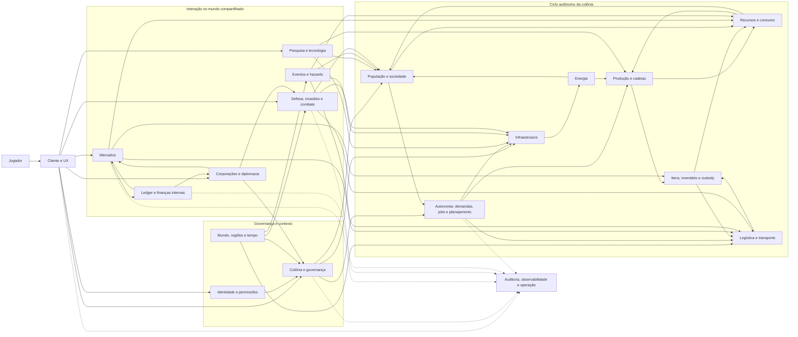

# Frontier — Discovery do Produto

**Status:** rascunho para revisão humana  
**Escopo:** descoberta do produto e dos domínios conceituais  
**Fora do escopo:** implementação, escolha final de tecnologias, contratos de API e schema de banco

## 1. Leitura executiva

Frontier é um jogo multiplayer persistente de colonização em um mundo compartilhado. O jogador não deve operar cada colono individualmente; ele define intenções, restrições e prioridades, enquanto a colônia converte essas decisões em trabalho, produção, logística, pesquisa, comércio e defesa.

O diferencial pretendido não é apenas ter muitos sistemas, mas fazer com que eles formem uma cadeia causal legível:

```text
decisão do jogador
→ plano e prioridades da colônia
→ demandas e jobs
→ ação de colonos e infraestrutura
→ transformação física de recursos, pessoas e território
→ economia, riscos e eventos
→ novas decisões do jogador
```

O risco principal nesta fase é confundir profundidade com quantidade de features. O produto precisa primeiro provar um ciclo pequeno, coerente e compreensível, antes de assumir mercado, corporações, invasões, combate de alta escala e simulação detalhada de cada indivíduo.

## 2. Product Vision proposta

> **Frontier é um simulador multiplayer persistente de colonização em que o jogador governa uma sociedade emergente por meio de objetivos, políticas e estratégia — e não por microgerenciamento. Cada recurso, relacionamento, rota e conflito deixa consequências no mundo compartilhado, permitindo que colônias se especializem, cooperem, negociem e disputem seu futuro.**

### 2.1 Promessa ao jogador

O jogador deve sentir que:

- suas decisões estratégicas alteram o comportamento coletivo da colônia;
- os colonos são agentes com história e capacidade de agir, não apenas números de produção;
- produção e comércio têm geografia, dependências e riscos reais;
- o mundo continua evoluindo sem exigir presença constante;
- problemas podem ser entendidos e resolvidos por meio de políticas e prioridades;
- histórias emergentes surgem da interação entre pessoas, recursos, instituições e eventos.

### 2.2 O que Frontier não pretende ser, por enquanto

- um city builder puramente manual;
- um jogo de cliques por colono ou por receita;
- um mercado abstrato em que toda mercadoria teleporta;
- um combate resolvido apenas por um valor de poder;
- um produto de dinheiro real ou uma economia financeira real para jogadores;
- uma demonstração de tecnologias distribuídas sem necessidade de produto.

## 3. Game Pillars

### Pilar 1 — Governança por intenção

O jogador define metas, políticas, prioridades, orçamento, expansão e doutrina. A colônia decide como executar dentro dessas regras.

**Critério de sucesso:** uma decisão de alto nível deve gerar consequências operacionais observáveis sem exigir que o jogador atribua manualmente cada tarefa.

**Risco:** autonomia imprevisível ou pouco legível pode parecer incompetência do sistema. Toda ação importante precisa ter motivo, custo, prioridade e resultado explicáveis.

### Pilar 2 — Pessoas com agência e memória

Cada colono é uma entidade individual com competências, necessidades, saúde, relações, experiência, lealdade e histórico. A população deve produzir histórias e restrições reais para a colônia.

**Critério de sucesso:** substituir ou perder um colono relevante muda possibilidades da colônia, mas não torna o jogo arbitrariamente impossível.

**Risco:** simular detalhes individuais demais pode destruir performance e clareza. A fidelidade precisa ser graduada por relevância.

### Pilar 3 — Causalidade material e logística

Recursos, itens e pessoas ocupam localizações e percorrem rotas. Capacidade, distância, energia, armazenamento e risco devem limitar decisões econômicas.

**Critério de sucesso:** uma escassez ou atraso pode ser rastreado até a cadeia que o causou e pode ser mitigado por decisões alternativas.

**Risco:** deslocamento excessivamente lento ou burocrático pode transformar o jogo em uma tela de espera.

### Pilar 4 — Economia emergente entre jogadores

Colônias podem se especializar, negociar, competir e formar instituições. Preços e oportunidades devem refletir oferta, demanda, região, custos e risco.

**Critério de sucesso:** jogadores diferentes podem prosperar por estratégias econômicas distintas, sem que uma única cadeia domine todo o mundo.

**Risco:** mercados sem liquidez, manipulação ou vantagem de jogadores antigos podem inviabilizar a experiência de entrada.

### Pilar 5 — Mundo persistente com risco administrável

O mundo continua evoluindo, mas o jogador offline não deve ser destruído por uma janela curta de ausência. Conflitos precisam criar decisões e consequências, não apenas punição irreversível.

**Critério de sucesso:** ausência gera exposição e escolhas de preparação, mas não exige vigilância contínua.

**Risco:** proteger demais o jogador elimina o significado da invasão e da logística.

### Pilar 6 — Sistemas legíveis e consequência explicável

Profundidade só é útil se o jogador consegue entender estado, causa, previsão, falha e alternativa. Painéis, alertas, histórico e visualizações são parte da fantasia de governar.

**Critério de sucesso:** diante de um problema, o jogador consegue responder “o que aconteceu, por quê e qual decisão posso tomar?”.

## 4. Modelo conceitual do produto

As entidades conceituais centrais são:

| Entidade | Papel no produto |
| --- | --- |
| Jogador | Define intenção e controla uma ou mais colônias conforme regras de ownership |
| Colônia | Unidade política e operacional principal |
| Colono | Agente individual que executa trabalho, forma relações e sofre consequências |
| Infraestrutura | Capacidade material que transforma, armazena, transporta ou protege |
| Recurso | Material fungível usado por consumo, produção, comércio e construção |
| Item | Objeto individual com identidade, estado, qualidade e localização |
| Rota/Transporte | Movimento físico de recursos, itens ou colonos |
| Região | Unidade espacial do mundo compartilhado |
| Ordem/Contrato | Compromisso econômico ou de transferência entre participantes |
| Instituição | Corporação, governo ou grupo que agrega ownership e permissões |
| Evento | Mudança temporal ou externa que cria risco, oportunidade ou perturbação |

## 5. Mapa de domínios e sistemas

### 5.1 Identidade, conta e governança

- identidade, autenticação e autorização;
- perfil do jogador;
- ownership de colônias e ativos;
- permissões dentro de colônias e corporações;
- políticas, prioridades, metas e orçamento;
- notificações, relatórios e histórico de decisões.

### 5.2 Mundo e tempo

- geração e configuração do mundo;
- regiões, biomas, recursos, clima e hazards;
- topologia, distância e adjacência;
- tempo persistente, ticks, turnos lógicos e simulação offline;
- eventos regionais e globais;
- ciclo de vida do mundo, temporadas ou reset, se houver.

### 5.3 Colônia e infraestrutura

- fundação e expansão territorial;
- assentamentos e zonas;
- prédios, módulos, upgrades e manutenção;
- armazenamento e capacidade;
- energia e redes;
- integridade, danos, reparo e desativação.

### 5.4 População e sociedade

- colonos individuais;
- necessidades, saúde, idade e mortalidade;
- skills, experiência, traits e especializações;
- relações, família, reprodução e dependentes;
- lealdade, moral, cultura e qualidade de vida;
- imigração, recrutamento, contratos e transferência;
- substituição de agentes, automatização e drones.

### 5.5 Autonomia e execução

- estado observado da colônia;
- sistema de demanda e déficit;
- objetivos e prioridades;
- jobs, reservas e alocação de agentes;
- seleção por capacidade, distância, risco e utility;
- planejamento de tarefas compostas;
- execução, interrupção, replanejamento e feedback;
- explicação de decisões e causas de não execução.

### 5.6 Recursos, produção e consumo

- catálogo de recursos, receitas e produtos;
- extração;
- agricultura, pecuária e alimentos;
- indústria, refino e componentes;
- consumo da população e da infraestrutura;
- qualidade, perdas, resíduos e transformação;
- capacidade produtiva, gargalos e manutenção.

### 5.7 Itens e inventário

- itens únicos e itens fungíveis;
- localização, owner e cadeia de custódia;
- reserva, equipamento, transferência e descarte;
- durabilidade, qualidade, modifiers e dano;
- estados exclusivos como `STORED`, `EQUIPPED`, `RESERVED`, `IN_TRANSIT`, `DROPPED`, `DAMAGED` e `DESTROYED`;
- concorrência e prevenção de duplicação.

### 5.8 Logística e transporte

- warehouses, depósitos e nós logísticos;
- capacidade, rotas, distância e tempo;
- filas, priorização e consolidação de carga;
- transporte de recursos, itens e colonos;
- risco, interceptação, perda, atraso e seguro;
- entrega, recebimento e reconciliação.

### 5.9 Pesquisa e tecnologia

- laboratórios e capacidade de pesquisa;
- árvore ou rede tecnológica;
- pesquisas assíncronas;
- especializações e pré-requisitos;
- influência de colonos, instituições e descobertas;
- desbloqueios que alteram produção, logística, sociedade ou defesa.

### 5.10 Economia e mercados

- resource market por quantidade;
- item market por objeto individual;
- contratos e transferência de colonos;
- buy orders, sell orders, matching e liquidação;
- regiões, preços, taxas e custos de transporte;
- crédito, risco, garantias, propostas privadas e trocas;
- liquidez inicial, proteção contra abuso e regras de cancelamento.

### 5.11 Sistema financeiro

- wallets e contas contábeis;
- ledger de partidas dobradas;
- débito, crédito e reserva;
- escrow, capture, refund e reconciliação;
- idempotência e audit log;
- separação explícita entre moeda do jogo e dinheiro real;
- insolvência, crédito e limites, se existirem.

### 5.12 Diplomacia, corporações e instituições

- corporações/guildas;
- membros, papéis e permissões;
- recursos e infraestrutura compartilhados;
- acordos, tarifas, fronteiras e acesso;
- reputação, confiança, sanções e relações;
- projetos coletivos e governança interna.

### 5.13 Defesa, invasão e combate

- segurança da colônia;
- ameaças, alertas e preparação;
- doutrina e objetivos definidos pelo jogador;
- squads, equipamentos, terreno, cover e movimento;
- skill, moral, fadiga, ferimentos, retirada, rendição e captura;
- ataque a infraestrutura, roubo, sabotagem, espionagem e interceptação;
- regras de proteção offline e recuperação pós-conflito.

### 5.14 Cliente, apresentação e confiança do jogador

- dashboard estratégico;
- mapa e representação espacial;
- timeline e replay de eventos;
- inspeção de colônia, colono, cadeia produtiva e transporte;
- alertas priorizados;
- explicações de decisão da autonomia;
- ações em lote e edição de políticas;
- acessibilidade, localização e tolerância a reconexão.

### 5.15 Capacidades transversais

- versionamento de regras e conteúdo;
- auditoria e histórico;
- observabilidade técnica e métricas de negócio;
- administração, suporte e ferramentas de operação;
- moderação, anti-cheat e segurança;
- backup, restauração, migração e recuperação de desastre;
- testes determinísticos, replay e diagnóstico de simulação.

## 6. Dependências conceituais

O sistema não deve ser implementado na ordem da lista de features. A dependência conceitual mais importante é:

1. identidade, ownership, tempo e mundo fornecem o contexto;
2. colônia, população, infraestrutura e recursos formam o estado material;
3. demanda, jobs e autonomia transformam intenção em ação;
4. produção, inventário, energia e logística transformam e movimentam valor;
5. pesquisa aumenta possibilidades;
6. mercados, finanças e contratos conectam colônias;
7. corporações, diplomacia e combate disputam acesso, território e valor;
8. cliente, auditoria e observabilidade tornam tudo operável e compreensível.

### 6.1 Dependências mais sensíveis

| Dependência | Por que é crítica |
| --- | --- |
| Tempo → todos os sistemas | Define ticks, atrasos, cooldowns, crescimento, combate e processamento offline |
| Ownership → todos os estados relevantes | Impede dois subsistemas de alterarem a mesma verdade sem coordenação |
| Localização → recursos, itens, pessoas e dinheiro | Determina logística, risco, posse e resolução de transações |
| Demanda → jobs → execução | É o núcleo da promessa de autonomia |
| Reserva → inventário, produção, transporte e finanças | Evita dupla alocação de bens, capacidade ou fundos |
| Estado de infraestrutura → produção e energia | Conecta falhas físicas a consequências econômicas |
| Ledger → mercados e contratos | Torna pagamentos auditáveis e recuperáveis após falhas |
| Regras de offline → invasões e eventos | Define se persistência é interessante ou injusta |
| Explicabilidade → UX e autonomia | Sem ela o jogador não consegue governar sistemas autônomos |

## 7. Funcionalidades importantes ainda não explicitadas

Estas funcionalidades provavelmente serão necessárias para o produto ser jogável e operável, embora não sejam o foco da fantasia principal:

### Experiência do jogador

- onboarding e primeira colônia guiada;
- objetivos iniciais e curva de complexidade;
- presets de política e automação gradual;
- pause conceitual, velocidade ou planejamento com atraso;
- desfazer/cancelar com regras claras;
- comparação entre previsão e resultado;
- busca, filtros e navegação entre causas e efeitos;
- resumos para jogador offline.

### Persistência e continuidade

- retomada após desconexão;
- cálculo de eventos durante ausência;
- limites de processamento por colônia e por região;
- salvamento consistente e recuperação;
- replay determinístico para suporte e disputas;
- política de morte, abandono, inatividade e transferência de conta.

### Mundo e conteúdo

- geração/configuração inicial do mundo;
- distribuição e renovação de recursos;
- clima, estação, desastres e mudanças ambientais;
- NPCs, fauna, facções ou mercado inicial, se necessários para preencher o mundo;
- raridade, descoberta, exploração e informação incompleta;
- objetivos de longo prazo e possíveis condições de vitória;
- limites de população, território e número de colônias por jogador.

### Economia e segurança

- criação e destruição de moeda;
- inflação, sinks, taxas e emissão;
- prevenção de multi-accounting, bots, lavagem e manipulação de mercado;
- limites de crédito e falência;
- disputa de transação e atendimento ao jogador;
- regras para presentes, empréstimos, herança e transferência entre contas;
- separação entre recursos obtidos no jogo e qualquer pagamento real.

### Conflito e sociedade

- regras de proteção para iniciantes;
- declaração de guerra, casus belli ou custo de agressão;
- seguros, recuperação e reconstrução;
- captura, resgate, deserção e tratamento de prisioneiros;
- reputação e consequências diplomáticas;
- governança interna, sucessão e perda de liderança;
- moderação de nomes, mensagens e comportamento abusivo.

### Operação e qualidade

- painel administrativo;
- métricas de saúde e métricas de economia;
- feature flags e rollout de regras;
- compatibilidade de versões de simulação;
- ferramentas de inspeção sem alterar o estado;
- manutenção planejada, incidentes e comunicação de mudanças;
- matriz de testes de estado, concorrência, falha e carga.

## 8. Ambiguidades, tensões e decisões abertas

### A. Real-time, ticks e processamento offline

O documento menciona mundo persistente, simulação baseada em ticks e atividades assíncronas, mas não define se o tempo é contínuo, discreto, acelerável ou processado por eventos.

**Alternativas:** tempo contínuo; ticks globais; ticks por região; event-driven com janelas de simulação.  
**Recomendação provisória:** adotar um modelo lógico de tempo discreto e determinístico para regras críticas, permitindo agrupar ticks quando a colônia estiver inativa. Isso preserva auditabilidade sem obrigar todos os detalhes a rodarem na mesma frequência.

### B. Autonomia versus controle direto

O jogador deve administrar intenções, mas ainda não está definido quais ações podem ser manuais e quais são sempre delegadas.

**Pergunta:** o jogador pode comandar um colono, cancelar um job, mover um item ou ordenar uma unidade diretamente?  
**Risco:** controle direto irrestrito invalida a autonomia; autonomia irrestrita reduz agência do jogador.

### C. Individualidade versus escala

“Cada colono é uma entidade individual” entra em tensão com grandes populações e simulação frequente.

**Recomendação provisória:** manter identidade individual, mas usar níveis de fidelidade: colonos críticos recebem simulação detalhada; colonos distantes ou pouco relevantes podem usar agregações até que uma interação exija detalhe.

### D. Java e Rust como autoridades

A matriz preliminar sugere Java para economia/conta e Rust para simulação, mas produção, inventário, logística, colonos e energia atravessam os dois mundos.

**Questão crítica:** Rust calcula uma decisão ou é autoridade sobre o estado persistido?  
**Recomendação provisória:** cada agregado mutável deve ter uma única autoridade; outros componentes publicam comandos ou recebem snapshots/eventos. Cálculo paralelo não deve significar dupla escrita concorrente.

### E. Simulação física versus ritmo do jogador

Transportar tudo fisicamente cria decisões interessantes, mas pode tornar comércio e produção lentos demais.

**Perguntas:** o transporte tem duração observável? Pode ser consolidado? Pode ser acelerado por infraestrutura? Existe transporte instantâneo apenas para certos itens?

### F. Economia de jogadores versus liquidez inicial

Uma economia majoritariamente entre jogadores pode não funcionar quando há poucos jogadores ou pouca oferta.

**Alternativas:** NPCs e ordens de referência; subsídios iniciais; mercado regional administrado; economia sem piso de liquidez.  
**Decisão necessária:** qual papel o sistema ocupa quando o mercado de jogadores está vazio?

### G. Invasão e proteção offline

“Jogador offline não deve ser inviabilizado” pode entrar em conflito com invasões significativas.

**Alternativas:** janelas de vulnerabilidade; defesa autônoma com objetivos limitados; guerra declarada; escudos com custo; proteção por camadas de ativos.  
**Decisão necessária:** qual perda é aceitável e qual é proibida?

### H. Colonist Contract Market

Negociar contratos de colonos pode ser uma forma interessante de especialização, mas precisa definir consentimento, direitos, duração, transporte, família, deserção, resgate e abuso.

**Recomendação provisória:** começar tratando o mercado como contratos de trabalho/serviço com termos explícitos, e não como transferência irrestrita de pessoas.

### I. Combate e fidelidade

O documento quer simulação baseada em ticks, autonomia e grandes batalhas. Ainda não está definido o nível mínimo de detalhe que mantém decisões estratégicas significativas.

**Pergunta:** o jogador controla composição e doutrina, ou também formações e alvos?  
**Recomendação provisória:** o jogador define objetivos, regras de engajamento e doutrina; o sistema executa e gera um relatório auditável.

### J. Escopo da moeda

Wallet, ledger, crédito, escrow e integração futura com payment provider representam problemas diferentes.

**Decisão necessária:** qual é a moeda interna, quem a emite, como é destruída e se ela é transferível entre todos os jogadores? A integração com dinheiro real deve ficar fora do núcleo do jogo e fora do primeiro produto jogável.

### K. Persistência do mundo

Não foi definido se o mundo é permanente, sazonal, reiniciado ou particionado em servidores/mundos independentes.

Essa decisão afeta progressão, valor de ativos, onboarding, recuperação de desbalanceamentos e estratégia de conteúdo.

### L. Vitória e propósito de longo prazo

O documento descreve expansão, economia e conflito, mas não define o que significa “vencer”, concluir uma era ou permanecer relevante.

Sem uma resposta, o produto pode virar apenas manutenção infinita ou competição econômica sem direção.

## 9. Status das respostas de Macro System

As perguntas originais não ficam mais repetidas aqui. Esta seção é o registro consolidado do que já foi decidido e do que ainda está pendente.

### Decisões confirmadas

#### Experiência e ritmo

- prioridade da experiência: **governar uma colônia → competir por poder → construir uma economia → contar histórias de colonos**;
- sucesso é relativo: colônias podem se especializar em comida, armas, soldados, comércio ou outras funções;
- organização mínima deve caber em aproximadamente 40 minutos por dia;
- o jogador deve conseguir participar entrando pelo menos 3 vezes por semana;
- o mundo terá velocidade fixa;
- o mundo será persistente e não terá reset/temporadas por enquanto.

#### Operação offline

- a colônia continua funcionando sem o jogador;
- decisões críticas, como iniciar uma invasão, não são tomadas automaticamente;
- comércio automático só poderá acontecer no futuro por meio de rotas comerciais previamente configuradas.

#### População

- a colônia começa com 3 colonos básicos;
- os colonos são gerados aleatoriamente, mas a geração deve garantir um começo viável;
- reprodução cria novos colonos;
- satisfação alta pode atrair imigrantes;
- não haverá NPCs ou facções externas inicialmente;
- fauna pode existir;
- corporações/facções serão formadas por jogadores;
- o primeiro escopo precisa considerar 3 colonos individualmente.

#### Saúde e mortalidade

- colonos não morrem com frequência a cada incidente;
- invasões recebidas e invasões malsucedidas podem causar ferimentos, doenças ou cicatrizes;
- condições não tratadas podem piorar e gerar debuffs;
- condições podem ser tratadas e recuperadas;
- três condições permanentes graves podem levar à morte.

O significado exato de “três condições” ainda precisa ser fechado: a proposta é contar três condições graves simultâneas, e não um contador irreversível ao longo da vida.

#### PvP e invasões

- PvP é opcional;
- uma colônia precisa se liberar para invasões para poder invadir outras;
- invasões são preparadas e avisadas com antecedência;
- o defensor tem tempo para se preparar;
- uma derrota não elimina a colônia do dia para a noite;
- o atacante pode escolher itens/recursos para tentar roubar;
- o defensor pode manter um estoque seguro, limitado por peso e por tipos de itens;
- combate é essencial ao produto;
- a invasão termina quando os combatentes designados são derrotados e os sistemas de segurança são desativados.

### Decisões ainda pendentes

1. **Autonomia:** quais interações serão automáticas, quais terão controle manual e quando o jogador poderá substituir a colônia. Isso será definido depois do inventário completo de interações.
2. **Qualidade da autonomia:** prioridades usadas quando duas necessidades competirem. A proposta segurança → necessidades → estabilidade → políticas → eficiência aguarda validação no inventário de interações.
3. **Ciclo detalhado:** o mundo será contínuo em tempo real, mas ainda faltam durações de tarefas, eventos, viagens, combates e tratamento offline.
4. **Finanças:** emissão, destruição, taxas, sinks, reservas, escrow e separação do dinheiro real.
5. **Mercado:** regras finais de ordens, cancelamentos, disputas, taxas e quando cada mercado será liberado.
6. **PvP:** custo depois dos 7 dias gratuitos, duração das proteções pagas, cooldowns e regras de ativação/desativação.
7. **Saque e destruição:** quais recursos, itens, prédios e condições podem ser afetados permanentemente.
8. **Anti-snowball:** calibrar limites de dano, proteção de iniciantes, custos de guerra e recuperação.
9. **Primeiro ciclo jogável:** sequência mínima que prova governança, autonomia e defesa básica.
10. **Operação:** relatórios obrigatórios, ferramentas de recuperação, métricas e conteúdo configurável.

## 10. Recorte recomendado para a próxima etapa

Não é uma task de implementação; é uma proposta de foco para a revisão humana.

### Núcleo de validação da visão

Validar primeiro um ciclo conceitual com:

```text
colônia
→ colonos e necessidades
→ demanda
→ job autônomo
→ produção/consumo
→ armazenamento
→ política do jogador
→ nova decisão da colônia
```

Esse núcleo deve permitir responder:

- a autonomia é compreensível?
- prioridades do jogador produzem diferenças reais?
- o estado da colônia é observável?
- falhas têm causas e alternativas?
- a individualidade dos colonos agrega valor?

Depois disso, a segunda camada natural é logística local, energia e defesa básica. O combate entra no núcleo porque é essencial à visão; mercado/ledger e invasões PvP completas podem entrar depois que localização, reserva, tempo e ownership estiverem conceitualmente estáveis.

## 11. Mermaid inicial — mapa conceitual de sistemas



## 12. Resultado da etapa

Frontier tem uma visão promissora, mas ainda não está pronto para gerar tasks de implementação. As decisões com maior poder de alterar a arquitetura são: modelo de tempo, limites da autonomia, escala de colonos, ownership entre simulação e economia, tratamento offline, liquidez do mercado, perdas de conflito, permanência do mundo e objetivo de longo prazo.

O próximo artefato recomendado, após a revisão humana deste documento, é uma decisão de produto sobre o **menor ciclo jogável** e um mapa de contextos limitado a esse ciclo. Só então vale iniciar o Macro System Design.

## 13. Revisão v0.3 — respostas do fundador

Esta seção consolida as respostas mais recentes. “Confirmado” significa intenção atual do produto; “proposta” significa uma forma de transformar essa intenção em regra.

### 13.1 Direção do produto

Prioridade da experiência principal:

1. governar uma colônia;
2. competir por poder;
3. construir uma economia;
4. contar histórias de colonos.

O sucesso não será uma condição única de vitória. Colônias poderão buscar papéis diferentes, como exportar soldados, fornecer comida, produzir armas ou especializar-se em outros setores. Isso aponta para um modelo de sucesso relativo, baseado em estratégia, reputação, influência e especialização.

**Implicação:** “poder” não deve ser apenas força militar. Pode ser uma combinação de capacidade produtiva, influência, logística, tecnologia, alianças e defesa. Um ranking único de poder provavelmente reduziria a variedade desejada.

### 13.2 Ritmo de participação

Requisitos atuais:

- organização mínima da colônia em até aproximadamente 40 minutos por dia;
- possibilidade de jogar adequadamente entrando pelo menos 3 vezes por semana;
- jogadores que desejarem competir por poder podem investir mais tempo e atenção;
- velocidade do mundo fixa;
- a colônia continua funcionando sem o jogador;
- decisões críticas não são tomadas automaticamente.

**Consequência de design:** o jogo precisa privilegiar planejamento, filas, políticas, alertas e relatórios. Não pode depender de reação em tempo real ou de presença contínua para evitar uma catástrofe.

### 13.3 PvP e invasões

O PvP deve ser opcional. Uma colônia precisa se liberar para invasões para poder invadir outras colônias. A invasão deve ser anunciada e oferecer tempo real de preparação. O jogador não deve perder a colônia de um dia para o outro.

Regras desejadas até aqui:

- a colônia pode sofrer invasão;
- uma invasão deve ser uma ação preparada, não um ataque instantâneo;
- o alvo recebe aviso e tem uma janela para reagir;
- a derrota não transfere automaticamente a propriedade da colônia;
- uma fábrica pode parar por falta de recursos, mas a colônia não deve ser apagada;
- o atacante pode escolher o que tenta roubar;
- o defensor pode manter um estoque seguro, limitado por peso e por tipos de itens;
- combate é essencial ao produto, mas não deve permitir snowball ou griefing sem contramedidas.

**Modelo aprovado como base:** três estados de PvP por colônia — `PROTECTED`, `OPEN` e `ENGAGED`.

- `PROTECTED`: não pode iniciar nem receber invasões; possui limitações para competir por certos benefícios de guerra;
- `OPEN`: pode iniciar e receber invasões; a troca para este estado tem cooldown e não pode ser usada para escapar de uma guerra;
- `ENGAGED`: está em uma invasão declarada e permanece vulnerável até o encerramento da operação.

A proteção contra PvP poderá ser comprada de um NPC. A proteção inicial será gratuita por 7 dias. Depois disso, uma colônia poderá pagar pela proteção, o que deve ser economicamente interessante para operações lucrativas e pouco militares, como fazendas. Também será possível desativar a proteção permanentemente.

As colônias ocupam espaço real em um servidor. Portanto, alcance, escolha de alvos e distância de invasão dependem da posição física e dos espaços disponíveis para colônias; não são regras abstratas de matchmaking.

Uma invasão poderia seguir:

```text
declaração → janela de preparação → deslocamento → combate → breach/defesa
→ saque ou falha → recuperação e cooldown
```

O custo após a proteção inicial, os cooldowns, os alvos permitidos, o limite de saque e a proteção de iniciantes continuam abertos.

### 13.4 Mundo e população inicial

Decisões atuais:

- mundo persistente, sem reset ou temporada por enquanto;
- sem NPCs e sem facções externas;
- fauna pode existir;
- não haverá corporações na v1; um sistema de clãs pode ser considerado depois;
- cada jogador poderá possuir apenas uma colônia;
- cada mapa terá aproximadamente o tamanho de um mapa de *RimWorld*;
- o território é o limite físico para prédios, sem um limite artificial fixo de quantidade;
- a população madura ficará normalmente abaixo de 40 colonos, com limite máximo de 100;
- cada nova colônia começa com 3 colonos básicos;
- os 3 colonos são gerados aleatoriamente;
- a geração deve garantir capacidade mínima para iniciar;
- a população começa com funções básicas e não pode nascer com uma condição que impeça o começo;
- população cresce por reprodução;
- satisfação alta pode gerar imigração espontânea.

**Regra adicional recomendada:** a geração aleatória deve validar um conjunto mínimo de cobertura, por exemplo capacidade de obter alimento, água, abrigo e manutenção básica. Isso preserva variedade sem criar uma abertura impossível. O limite de 100 é de população; prédios continuam limitados pelo espaço físico disponível.

### 13.5 Saúde e mortalidade

O modelo desejado é de mortalidade indireta e consequência persistente, não de morte frequente como em *RimWorld*.

- invasões recebidas e invasões malsucedidas podem causar condições;
- condições podem ser cicatrizes, doenças ou lesões;
- condições não tratadas podem piorar;
- uma condição grave pode ocupar mais de um espaço/nível de gravidade;
- tratamento pode reduzir ou recuperar condições;
- três condições permanentes graves podem causar a morte do colono.

Há uma tensão terminológica entre “condição permanente” e “condição tratável”. A formulação mais clara para o sistema seria:

- **temporária:** desaparece com tempo ou tratamento;
- **persistente:** pode ser tratada e reduzida, mas deixa risco ou sequela;
- **grave:** estágio que ocupa capacidade de saúde e pode contribuir para mortalidade;
- **fatal:** estado terminal quando as regras de mortalidade são atingidas.

**Regra provisória aprovada:** contam três condições graves simultâneas. Assim, tratamento e prevenção continuam tendo valor e a morte não vira uma contagem inevitável ao longo da vida.

### 13.6 Conceitos que ficaram pouco claros

#### Escala definida

Escala não é somente tamanho do mapa. É o conjunto de limites que o sistema precisa suportar. As decisões atuais são:

| Dimensão | Exemplo da pergunta |
| --- | --- |
| Dimensão | Direção atual |
| --- | --- |
| Colônia | Uma única colônia por jogador; prédios limitados pelo território disponível |
| População | Normalmente até aproximadamente 40 colonos; limite absoluto de 100 |
| Mundo | Mapa aproximadamente do tamanho de um mapa de *RimWorld* |
| Interação | Colônias ocupam posições reais e têm distância entre si |
| Simulação | 3 colonos no início, com crescimento gradual |

Isso significa que Frontier deve otimizar a profundidade de uma colônia pequena/média, e não tentar simular milhares de colonos por jogador. O limite de 100 ainda precisa ser validado com testes de jogabilidade e performance, mas já pode orientar o desenho conceitual.

#### Explicabilidade da autonomia

É o sistema mostrar por que algo aconteceu. Exemplos:

- “A demanda de comida subiu porque a população cresceu e o estoque caiu.”
- “O job não foi atribuído porque não existe colono disponível com a skill necessária.”
- “A fábrica parou porque o estoque de cobre reservado foi enviado para outra ordem.”
- “O colono escolheu reparar a bomba antes de extrair pedra porque a política de sobrevivência tem prioridade maior.”

Isso não exige mostrar cálculo técnico interno; exige uma explicação útil para o jogador investigar e decidir.

#### Qualidade da autonomia

É definir o que o sistema prioriza quando não consegue fazer tudo ao mesmo tempo. Por exemplo, ele pode priorizar:

1. sobrevivência e segurança;
2. necessidades básicas;
3. estabilidade da infraestrutura;
4. políticas e metas do jogador;
5. eficiência e lucro;
6. conveniência ou melhoria de longo prazo.

**Proposta mantida:** essa hierarquia, com as políticas do jogador podendo alterar prioridades dentro de limites seguros. A escolha final será feita depois do inventário de todas as interações do jogo; não é necessário decidir a lista de controles antes de conhecer essas interações.

#### Localização e custody em tempo real

É decidir o nível de precisão necessário para saber onde um ativo está. Exemplos:

- minério fungível pode ser controlado como “500 ferro no armazém A”;
- uma arma única precisa ter localização e identidade próprias;
- um colono precisa existir em uma localização exata ou em trânsito;
- um carregamento precisa indicar origem, destino e rota.

**Requisito confirmado:** localização e custody devem ser informados explicitamente em tempo real. Recursos fungíveis podem ser agregados por estoque quando isso não esconder a posição relevante; itens únicos, colonos e carregamentos precisam de rastreamento individual. A definição do nível exato de precisão será um dos maiores desafios técnicos do projeto.

#### Ownership durante uma operação

Ownership é quem tem o direito sobre o ativo. Custody é quem o guarda ou transporta. Reservation é quem tem aquele ativo separado para uma operação.

Exemplo de venda:

```text
ferro pertence ao vendedor
→ ferro é reservado para uma ordem
→ transportador recebe a custody
→ comprador recebe ownership na entrega confirmada
```

Para dinheiro:

```text
créditos pertencem ao comprador
→ ficam reservados
→ entram em escrow
→ vendedor recebe após entrega
→ refund ocorre se a operação for cancelada segundo a regra
```

Essa separação evita que “estar dentro de uma fábrica”, “estar em uma carroça” ou “estar reservado” crie duplicação ou transferência indevida.

#### Clãs e ownership coletivo

Clãs seriam organizações criadas por jogadores, equivalentes a guildas ou companhias. Eles poderiam ter membros, cargos, tesouraria, instalações compartilhadas, contratos, projetos e relações diplomáticas.

Clãs não fazem parte da v1. A arquitetura de combate, porém, não deve assumir que toda unidade de combate é uma colônia: ela deve permitir a composição de uma `CombatEntity` por colonos, reforços e outras entidades combatentes. Isso permite adicionar clãs depois sem reescrever o núcleo do combate.

#### Contratos de colonos

Contrato não significa necessariamente vender uma pessoa. Seria um acordo entre colônias para um colono trabalhar, ser emprestado ou prestar serviço por determinado período, com salário, duração, transporte, direitos e condições de retorno.

**Decisão atual:** o sistema entra na v1. Reprodução e imigração continuam sendo formas de crescimento, enquanto contratos representam trabalho, serviço, empréstimo ou transferência temporária entre colônias. Direitos, duração, pagamento, transporte, retorno e impacto sobre famílias ainda precisam ser especificados.

## 14. Propostas para decisões ainda abertas

### 14.1 Ciclo de tempo

Para combinar mundo persistente, velocidade fixa e três acessos semanais, a regra aprovada é:

- relógio global contínuo em tempo real, com progressão em segundos;
- sem pause ou aceleração por jogador;
- ações possuem duração real;
- a colônia continua operando enquanto o jogador está offline;
- decisões críticas ficam pendentes até o jogador ou uma política autorizada resolvê-las;
- relatórios resumem o que ocorreu desde o último acesso.

O tamanho dos ciclos internos de processamento ainda será uma decisão técnica posterior. Para o jogador, o tempo deve ser contínuo e observável; “tick interno” não deve aparecer como uma pausa ou aceleração artificial.

### 14.2 Mercado inspirado no Bazaar

Uma boa referência conceitual para o mercado de recursos é um bazar com ordens:

- ordem de compra com preço e quantidade;
- ordem de venda com preço e quantidade;
- compra/venda imediata contra ordens existentes;
- saldo e mercadoria reservados enquanto a ordem está ativa;
- taxa de operação e regras de cancelamento;
- histórico de preço e volume;
- mercados regionais, quando a logística física estiver pronta.

Para não criar uma economia vazia no começo, o mercado terá um comprador e vendedor NPC de último recurso. O NPC compra por um valor baixo e vende por um valor alto, incentivando o jogador a negociar com outros jogadores sempre que houver alternativa. O Bazaar de jogadores continua sendo o mercado preferencial.

Isso mantém a colônia operando quando não há contraparte disponível, mas evita que o NPC seja a opção economicamente mais eficiente. O preço, a disponibilidade e as taxas ainda precisarão ser balanceados.

### 14.3 Anti-snowball e proteção contra abuso

“Snowball” significa que quem está na frente acumula tanta força, território e recursos que os demais deixam de ter uma resposta possível. As alternativas apresentadas foram aprovadas como direção de design:

- proteção inicial para colônias novas;
- invasões com declaração, custo e tempo de preparação;
- limite de dano e de saque por operação;
- estoque seguro limitado, nunca uma invulnerabilidade total;
- custos logísticos crescentes para operações distantes;
- recuperação e reconstrução após derrota;
- mais de um eixo de poder, permitindo competir por comida, tecnologia, defesa, logística ou comércio;
- nenhuma transferência instantânea da propriedade da colônia.

Os números e limites ainda precisam ser balanceados, mas a direção está definida: proteção não será uma invulnerabilidade absoluta, invasões terão custo/aviso/limite e nenhuma derrota apagará a colônia.

### 14.4 Arquitetura conceitual de combate

O combate deve ser modelado como confronto entre entidades combatentes, e não como uma regra especial de “colônia 1 contra colônia 2”. Uma `CombatEntity` pode ser composta por:

- colonos da própria colônia;
- reforços contratados ou aliados;
- unidades de defesa;
- drones, fauna ou outras entidades combatentes futuras.

Isso permite que uma batalha seja formada por diferentes reforços sem criar dependência do futuro sistema de clãs. Clãs podem ser adicionados posteriormente como uma origem de reforços, ownership ou comando coletivo.

### 14.5 Menor ciclo jogável recomendado

Como combate é essencial, o menor ciclo não precisa começar com PvP completo. Ele pode provar a governança e a defesa básica:

```text
3 colonos aleatórios válidos
→ necessidades de água/comida/abrigo
→ prioridades do jogador
→ demandas e jobs autônomos
→ extração e produção simples
→ armazenamento e consumo
→ energia e manutenção básica
→ fauna/hazard ou incidente local
→ preparação de defesa
→ relatório de consequências
```

Esse recorte responde se Frontier é divertido como colônia governada antes de adicionar mercado entre jogadores, corporações e invasões completas.

### 14.6 Plano inicial para a economia e as finanças

Para evitar que o sistema financeiro fique grande demais antes de existir uma economia jogável, a proposta é evoluir em camadas:

#### Camada 1 — crédito interno e NPC de último recurso

- uma moeda interna chamada provisoriamente `credits`;
- carteira do jogador/colônia registrada em ledger;
- crédito inicial para fundar a colônia;
- NPC compra recursos por preço baixo e vende por preço alto;
- compras e vendas do NPC têm limites ou preço variável para não criar dinheiro infinito sem controle;
- sinks iniciais: construção, manutenção, transporte, reparos, taxas de mercado e proteção contra PvP;
- nenhum dinheiro real e nenhum saque financeiro entre jogadores.

#### Camada 2 — mercado de jogadores

- ordens de compra e venda no estilo Bazaar;
- créditos e mercadorias reservados enquanto a ordem estiver ativa;
- ordem combinada não entrega instantaneamente: gera uma obrigação de transporte;
- o vendedor mantém ownership até a entrega confirmada;
- o comprador mantém os créditos em escrow até a liquidação;
- cancelamento, falha, atraso e reembolso têm estados explícitos;
- taxa deve ser cobrada apenas em eventos definidos, para não esconder o custo real.

#### Camada 3 — contratos de colonos

- contrato com origem, destino, função, duração, pagamento e condições de retorno;
- salário e custos de transporte passam pelo ledger;
- o colono continua sendo uma entidade individual rastreável;
- família, consentimento, deserção, doença e encerramento antecipado precisam de regras próprias;
- contratos não transferem automaticamente a propriedade da pessoa.

#### Camada 4 — crédito avançado

Crédito, empréstimos e garantias só devem entrar se houver uma necessidade clara de gameplay. Escrow e reconciliação de transações são necessários para o mercado; crédito bancário não é necessário para provar o primeiro ciclo.

### 14.7 Plano para decidir a autonomia

Você está correto em adiar a lista de controles até mapear todas as interações. O processo recomendado é:

1. listar todas as interações do jogador, da colônia, dos colonos, da infraestrutura, do mercado e do combate;
2. para cada interação, identificar quem pode iniciar, cancelar, alterar e concluir;
3. classificar cada ação como **automática**, **manual**, **manual com sugestão** ou **crítica com confirmação**;
4. definir o que acontece quando o jogador não responde;
5. definir a prioridade quando duas ações competem;
6. simular uma semana de jogo com apenas 40 minutos de organização diária;
7. revisar se a autonomia cria decisões estratégicas ou apenas corrige falhas irritantes.

Esse inventário deve vir antes da escolha entre Utility AI, GOAP, HTN ou qualquer implementação específica. Primeiro se define o comportamento desejado; depois se escolhe a técnica adequada para cada tipo de decisão.
