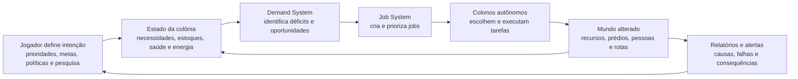
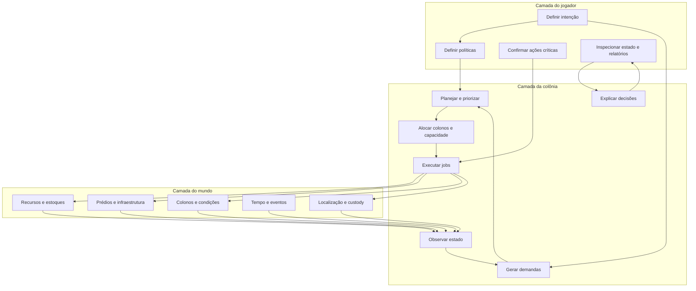
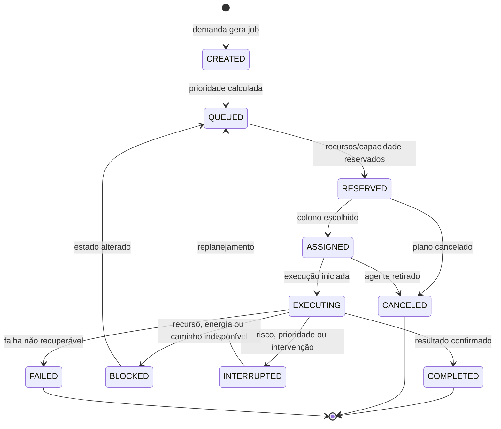

# Frontier — Interaction Inventory

**Status:** rascunho para revisão de produto  
**Versão:** v0.2  
**Objetivo:** mapear as interações do núcleo jogável antes de decidir autonomia, ownership e boundaries técnicos  
**Fora do escopo:** implementação, escolha de linguagem, APIs, banco de dados e desenho final de serviços

## 1. Por que este documento existe

Frontier promete que o jogador administra intenções enquanto a colônia administra tarefas. Para transformar essa promessa em arquitetura, precisamos saber exatamente:

- o que o jogador pode iniciar;
- o que a colônia pode decidir sozinha;
- quais ações exigem confirmação;
- quem pode cancelar ou substituir uma ação;
- quais estados são alterados;
- quais falhas e consequências precisam aparecer para o jogador.

Este documento não decide silenciosamente o que será automático. A coluna **Controle inicial** contém hipóteses para discussão.

## 2. Escopo do primeiro ciclo

O primeiro ciclo deve representar uma colônia pequena e funcional:

- uma colônia por jogador, ocupando um lote do tamanho de um mapa de *RimWorld*;
- 3 colonos iniciais;
- população com limite absoluto de 100;
- necessidades básicas;
- coleta de recursos;
- construção;
- produção e consumo;
- armazenamento;
- manutenção e condições de saúde;
- energia básica;
- pesquisa básica;
- fauna ou incidente local;
- preparação de defesa;
- tempo contínuo 1:1 com o real (um dia no jogo = 24 horas);
- operação enquanto o jogador está offline.

Mercado de jogadores, contratos de colonos e invasões completas fazem parte do produto, mas não precisam bloquear a validação do ciclo básico de governança. O mercado NPC de último recurso e contratos serão tratados como interações de produto da v1, mesmo que sua implementação seja posterior ao núcleo.

## 3. Vocabulário de controle

| Classificação | Significado |
| --- | --- |
| Manual | O jogador inicia e confirma a ação diretamente |
| Automático | A colônia inicia e executa conforme regras e políticas |
| Híbrido | O jogador define intenção; a colônia escolhe execução |
| Sugestão | O sistema recomenda uma ação, mas aguarda o jogador |
| Crítico | A ação pode continuar preparada, mas exige confirmação para produzir efeito irreversível |
| Futuro | Interação reconhecida, mas fora do ciclo atual |

Uma ação pode mudar de classificação após os testes. Por exemplo, “tratar doença” pode ser manual no começo e tornar-se híbrida quando o jogador definir uma política médica.

## 4. Visão visual do ciclo principal

O jogador participa principalmente em `P` e `R`. A colônia deve conseguir executar o ciclo entre esses dois pontos, exceto quando uma regra de segurança exigir confirmação.

## 5. Fronteiras conceituais de responsabilidade

Este diagrama mostra responsabilidades conceituais, não serviços. Um mesmo processo pode permanecer no mesmo módulo durante a primeira arquitetura.

## 6. Inventário de interações

### 6.1 Governança da colônia

| ID | Interação | Iniciador | Controle inicial | Efeito principal | Falhas/decisões abertas |
| --- | --- | --- | --- | --- | --- |
| GOV-01 | Criar colônia | Jogador | Manual | Cria território, 3 colonos e estado inicial | Validação de mapa e seed |
| GOV-02 | Nomear/configurar colônia | Jogador | Manual | Altera identidade e preferências | Regras de nomes e abuso |
| GOV-03 | Definir prioridade | Jogador | Manual | Altera ordenação de demandas | Conflito entre prioridades |
| GOV-04 | Definir meta de estoque | Jogador | Manual | Cria demanda de reposição | Limite e prioridade da meta |
| GOV-05 | Definir política | Jogador | Manual | Altera comportamento permitido | Quais políticas existem |
| GOV-06 | Habilitar/desabilitar prédio | Jogador | Manual | Abre ou fecha capacidade produtiva | Efeito sobre jobs e reservas |
| GOV-07 | Inspecionar estado | Jogador | Manual | Mostra causas, previsão e consequências | Nível de explicabilidade |
| GOV-08 | Receber relatório offline | Sistema | Automático | Resume alterações desde o último acesso | Agrupamento e severidade |
| GOV-09 | Cancelar plano | Jogador | Híbrido | Remove intenção ainda não executada | O que acontece com reservas |
| GOV-10 | Configurar política setorial | Jogador | Manual | Altera segurança, alimentação, saúde, energia, produção, descanso, fauna ou comércio | Parâmetros, limites e pesquisa necessária |
| GOV-11 | Criar ordem de produto/serviço | Jogador | Manual | Solicita quantidade, qualidade, prazo e restrições | Reserva, orçamento e substitutos |
| GOV-12 | Aprovar proposta de ambiente | Jogador | Crítico | Autoriza layout de base gerado pelo planner | Critérios de aprovação e custo |
| GOV-13 | Definir política de construção | Jogador | Manual | Orienta expansão e sugestões de layout | Quando a IA pode propor/construir |
| GOV-14 | Configurar manejo de fauna | Jogador | Manual | Define criação, alimentação, reprodução e abate | Limites de espaço e prioridade |
| GOV-15 | Usar capacidade desbloqueada | Jogador/colônia | Híbrido | Ativa opção de política liberada por pesquisa | Pesquisa pode liberar, mas não ativar sozinha |

### 6.2 População e saúde

| ID | Interação | Iniciador | Controle inicial | Efeito principal | Falhas/decisões abertas |
| --- | --- | --- | --- | --- | --- |
| POP-01 | Observar necessidade | Sistema | Automático | Atualiza fome, sede, saúde, descanso e moral | Frequência e precisão |
| POP-02 | Escolher trabalho | Colono | Automático | Seleciona job elegível | Utility, skill, distância e política |
| POP-03 | Interromper trabalho | Sistema/colono | Híbrido | Replaneja por risco ou necessidade | Quando interromper uma tarefa |
| POP-04 | Formar relacionamento | Colonos | Automático | Atualiza relação social | Regras de privacidade e afinidade |
| POP-05 | Reproduzir | Colonos/colônia | Automático | Gera novo colono após condições | Capacidade populacional e cuidados |
| POP-06 | Atrair imigrante | Colônia/mundo | Sugestão | Oferece possibilidade de entrada | Aceite automático ou confirmação |
| POP-07 | Aceitar imigrante | Jogador | Crítico | Adiciona novo colono | Capacidade, perfil e custo |
| POP-08 | Tratar condição | Colono/colônia | Híbrido | Reduz severidade ou risco | Prioridade médica e recursos |
| POP-09 | Piorar condição | Sistema | Automático | Cria debuff ou novo estágio | Tempo, negligência e tratamento |
| POP-10 | Morrer | Sistema | Automático | Remove colono após regra fatal | Três condições graves simultâneas |

### 6.3 Demandas, jobs e autonomia

| ID | Interação | Iniciador | Controle inicial | Efeito principal | Falhas/decisões abertas |
| --- | --- | --- | --- | --- | --- |
| AUT-01 | Observar estado | Sistema | Automático | Coleta fatos sobre mundo e colônia | Fonte de verdade |
| AUT-02 | Criar demanda | Sistema | Automático | Registra necessidade ou oportunidade | Duplicação e prioridade |
| AUT-03 | Priorizar demanda | Sistema | Híbrido | Combina política, urgência e risco | Hierarquia ainda aberta |
| AUT-04 | Criar job | Sistema | Automático | Converte demanda em trabalho executável | Decomposição de tarefas |
| AUT-05 | Reservar capacidade | Sistema | Automático | Separa colono, prédio, item ou energia | Concorrência e expiração |
| AUT-06 | Alocar job | Sistema/colono | Automático | Vincula agente e job | Regras de desempate |
| AUT-07 | Aceitar intervenção | Jogador | Manual | Substitui ou orienta uma decisão | Duração da intervenção |
| AUT-08 | Replanejar | Sistema | Automático | Troca de job após mudança de estado | Evitar thrashing |
| AUT-09 | Explicar decisão | Sistema | Automático | Mostra motivo de escolha, espera ou falha | Linguagem compreensível |

### 6.4 Recursos, produção e infraestrutura

| ID | Interação | Iniciador | Controle inicial | Efeito principal | Falhas/decisões abertas |
| --- | --- | --- | --- | --- | --- |
| PROD-01 | Extrair recurso | Colono/prédio | Automático | Adiciona recurso ao estoque | Ferramenta, skill e rendimento |
| PROD-02 | Construir prédio | Jogador/colônia | Híbrido | Converte materiais em infraestrutura | Ordem e cancelamento |
| PROD-03 | Iniciar receita | Prédio/colônia | Híbrido | Reserva entradas e inicia produção | Meta, fila e prioridade |
| PROD-04 | Completar receita | Prédio | Automático | Remove entradas e cria saída | Falha durante processamento |
| PROD-05 | Consumir recurso | População/prédio | Automático | Reduz estoque por necessidade | Reserva e prioridade |
| PROD-06 | Manter prédio | Colono/colônia | Híbrido | Evita degradação | Quando manutenção é obrigatória |
| PROD-07 | Quebrar prédio | Sistema | Automático | Reduz ou remove capacidade | Reparo, dano e perda |
| PROD-08 | Reparar prédio | Colono/colônia | Híbrido | Recupera capacidade | Recursos e urgência |
| PROD-09 | Armazenar recurso | Colono/sistema | Automático | Move recurso para estoque válido | Capacidade e rota |
| PROD-10 | Gerenciar energia | Rede/colônia | Automático | Distribui geração e consumo | Prioridade, bateria e apagão |
| PROD-11 | Definir prioridade de energia | Jogador | Manual | Ordena quais consumidores recebem energia primeiro | Padrão seguro sem configuração |
| PROD-12 | Racionar energia | Sistema | Automático | Desliga consumidores de baixa prioridade em déficit | Aviso, explicação e retomada |

### 6.5 Localização, custody e logística

| ID | Interação | Iniciador | Controle inicial | Efeito principal | Falhas/decisões abertas |
| --- | --- | --- | --- | --- | --- |
| LOG-01 | Reservar recurso | Produção/mercado | Automático | Impede dupla utilização | Expiração e cancelamento |
| LOG-02 | Mover recurso | Job logístico | Automático | Transfere entre localizações | Distância e interrupção |
| LOG-03 | Transferir custody | Sistema/transporte | Automático | Atualiza quem guarda o ativo | Momento exato da transferência |
| LOG-04 | Confirmar entrega | Destino | Automático | Finaliza transporte e obrigação | Falha, perda e duplicação |
| LOG-05 | Perder carga | Evento/combate | Automático | Altera estoque e contrato | Seguro e compensação |
| LOG-06 | Inspecionar localização | Jogador | Manual | Mostra posição, owner e custody | Atualização em tempo real |
| LOG-07 | Definir estoque seguro | Jogador | Manual | Protege itens/recursos limitados | Limite de peso e tipos |
| LOG-08 | Transportar colono | Colônia | Híbrido | Move colono entre localizações | Saúde, família e risco |

### 6.6 Eventos, fauna e defesa

As interações de invasão seguem o modelo aprovado no discovery (§8.14): aviso pela distância, horário de vulnerabilidade, doutrina obrigatória e alvos fixados na declaração.

| ID | Interação | Iniciador | Controle inicial | Efeito principal | Falhas/decisões abertas |
| --- | --- | --- | --- | --- | --- |
| DEF-01 | Detectar ameaça | Sistema | Automático | Cria alerta e demanda | Antecedência e informação |
| DEF-02 | Configurar defesa | Jogador | Manual | Define combatentes e doutrina | Regras de composição |
| DEF-03 | Preparar combat entity | Colônia | Híbrido | Compõe unidade com colonos/reforços | Ownership e comando |
| DEF-04 | Resolver fauna/incidente | Colônia | Híbrido | Protege colônia e recursos | Escala do incidente |
| DEF-05 | Declarar invasão | Jogador | Crítico | Inicia operação preparada | Custo, alcance e duração do aviso |
| DEF-06 | Comprar/renovar proteção NPC | Jogador | Manual | Mantém proteção contra PvP após o período gratuito | Preço, duração e cooldown |
| DEF-07 | Desativar proteção | Jogador | Crítico | Abre colônia para risco PvP | Irreversibilidade e aviso |
| DEF-08 | Receber aviso de invasão | Sistema | Automático | Notifica o defensor e inicia janela de preparação | Defensor não confirma; reage via DEF-02 ou doutrina offline |
| DEF-09 | Executar combate | Combat entities | Automático | Resolve confronto por ticks internos | Regras e autoridade |
| DEF-10 | Saquear alvo permitido | Atacante | Híbrido | Transfere carga limitada | Estoque seguro e limites |
| DEF-11 | Recuperar defesa | Colônia | Automático | Remove estado de breach e repara | Tempo e custo |
| DEF-12 | Receber proteção inicial | Sistema | Automático | Ativa 7 dias de proteção gratuita na criação da colônia | Aviso antes do fim |
| DEF-13 | Definir horário de vulnerabilidade | Jogador | Manual | Define quando combates podem ocorrer em `OPEN` | Duração e cooldown de alteração |
| DEF-14 | Executar doutrina offline | Colônia | Automático | Defende conforme doutrina sem o jogador | Conteúdo mínimo da doutrina |

### 6.7 Economia, NPC e contratos

| ID | Interação | Iniciador | Controle inicial | Efeito principal | Falhas/decisões abertas |
| --- | --- | --- | --- | --- | --- |
| ECO-01 | Vender para NPC | Jogador | Manual | Converte recurso em créditos por preço baixo | Limite, preço e emissão |
| ECO-02 | Comprar de NPC | Jogador | Manual | Obtém recurso por preço alto | Estoque e preço do NPC |
| ECO-03 | Criar ordem de compra | Jogador | Manual | Reserva créditos e busca oferta | Expiração e cancelamento |
| ECO-04 | Criar ordem de venda | Jogador | Manual | Reserva bens e busca comprador | Custody e entrega |
| ECO-05 | Combinar ordens | Mercado | Automático | Cria negociação e obrigação logística | Matching e prioridade |
| ECO-06 | Liquidar negociação | Mercado/ledger | Automático | Move créditos após entrega | Escrow, refund e idempotência |
| ECO-07 | Criar contrato de colono | Jogador | Manual | Propõe trabalho/serviço entre colônias | Direitos e duração |
| ECO-08 | Aceitar contrato | Jogador | Crítico | Compromete colono e pagamento | Família, saúde e retorno |
| ECO-09 | Cumprir contrato | Colono/colônia | Híbrido | Executa serviço e recebe pagamento | Falha e abandono |
| ECO-10 | Encerrar contrato | Jogador/sistema | Crítico | Retorna ou substitui colono | Penalidade e transporte |

### 6.8 Pesquisa e tecnologia

| ID | Interação | Iniciador | Controle inicial | Efeito principal | Falhas/decisões abertas |
| --- | --- | --- | --- | --- | --- |
| RES-01 | Escolher pesquisa | Jogador | Manual | Define o próximo objetivo tecnológico | Formato da árvore ou rede |
| RES-02 | Enfileirar pesquisas | Jogador | Manual | Mantém progresso enquanto o jogador está offline | Tamanho da fila |
| RES-03 | Sugerir pesquisa | Sistema | Sugestão | Recomenda pesquisa com base em gargalos observados | Evitar decidir pelo jogador |
| RES-04 | Alocar pesquisador | Colônia | Híbrido | Vincula colono e laboratório à pesquisa | Skill, prioridade e necessidades |
| RES-05 | Progredir pesquisa | Sistema | Automático | Acumula progresso em tempo real | Duração real e insumos |
| RES-06 | Bloquear pesquisa | Sistema | Automático | Pausa por falta de pesquisador, energia ou insumo | Explicação da causa |
| RES-07 | Concluir pesquisa | Sistema | Automático | Desbloqueia prédios, receitas, políticas ou defesas | Notificação e relatório |
| RES-08 | Cancelar/trocar pesquisa | Jogador | Manual | Interrompe pesquisa atual | Progresso perdido ou mantido |

### 6.9 Mundo e tempo

| ID | Interação | Iniciador | Controle inicial | Efeito principal | Falhas/decisões abertas |
| --- | --- | --- | --- | --- | --- |
| WLD-01 | Atribuir lote de colônia | Sistema | Automático | Posiciona a colônia no mundo de forma semialeatória | Escolha de região pelo jogador |
| WLD-02 | Avançar dia/noite | Sistema | Automático | Altera rotinas, luz, energia e riscos | Relógio global e fusos horários |
| WLD-03 | Gerar evento climático/hazard | Sistema | Automático | Cria risco ou oportunidade local | Aviso, escala e frequência |
| WLD-04 | Explorar espaço de conexão | Jogador/colônia | Híbrido | Revela recursos, rotas ou ameaças | Existência de conteúdo fora dos lotes |
| WLD-05 | Viajar entre lotes | Colônia | Híbrido | Move colonos ou carga pelos espaços de conexão | Duração real e risco |
| WLD-06 | Liberar lote inativo | Sistema | Automático | Recupera lote de colônia abandonada | Critério de inatividade e destino dos ativos |

## 7. Ciclo de vida de um job

### Invariantes preliminares

- um job ativo não pode possuir dois executores incompatíveis;
- uma reserva não pode ser usada simultaneamente por dois jobs;
- um job concluído não deve ser concluído novamente;
- cancelamento deve liberar reservas ou explicar por que elas permanecem;
- falha deve produzir uma causa observável;
- replanejamento não pode criar duplicação de produção ou consumo;
- uma intervenção manual precisa deixar histórico da decisão.

## 8. Interações que precisam de decisão do produto

O inventário revela que ainda não devemos escolher a técnica de IA. Primeiro precisamos decidir:

1. quais itens da tabela serão manuais, automáticos, híbridos ou críticos;
2. quais ações o jogador pode cancelar depois que começaram;
3. quais ações podem continuar sem resposta do jogador;
4. como o jogador substitui uma decisão autônoma;
5. quais políticas podem alterar a ordem de prioridade;
6. quais eventos exigem confirmação e quais apenas geram relatório;
7. quais operações são locais à colônia e quais cruzam regiões;
8. quando localização e custody mudam durante um job;
9. qual é a unidade real de tempo de cada interação;
10. quais interações precisam de histórico e replay.

## 9. Próximo passo

Após revisar este inventário, o próximo artefato deve ser o **Macro System Design do núcleo da colônia**, limitado inicialmente a:

- Colony Governance;
- Population;
- Autonomy;
- Infrastructure;
- Resources and Production;
- Energy;
- Research;
- Inventory and Local Logistics;
- World/Time;
- Basic Defense.

Market, Finance, Colonist Contracts e PvP completo podem ser mapeados como contextos relacionados, mas não precisam definir o primeiro boundary de implementação.
