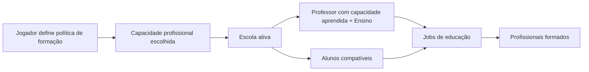
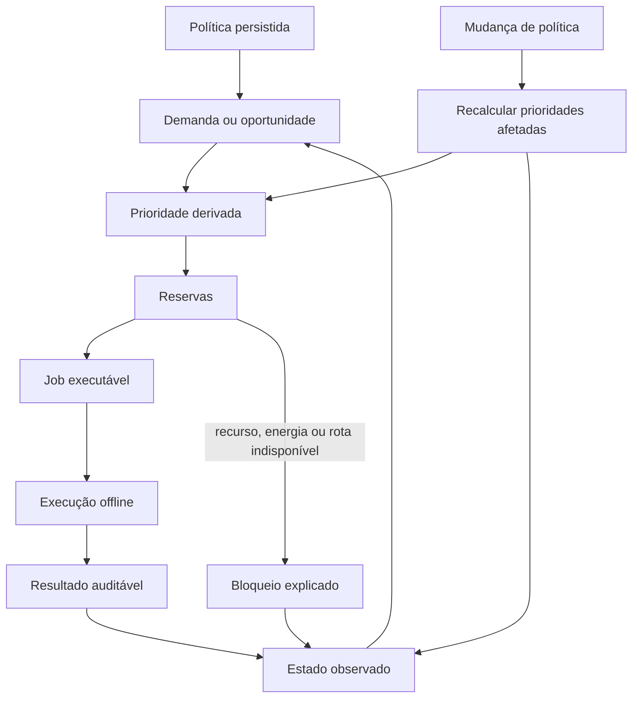
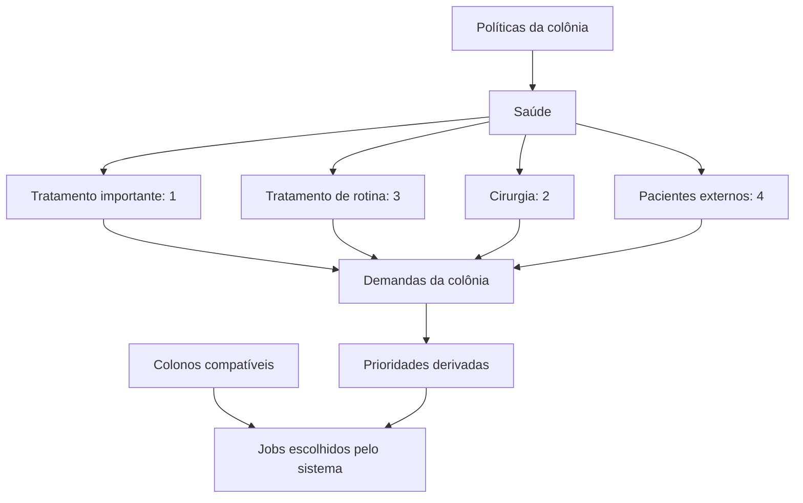

# Macro System Design — Autonomy

## 1. Objetivo

Autonomy transforma políticas e ordens persistidas em demandas, prioridades e jobs executáveis. O jogador governa a colônia por regras; o sistema escolhe a execução cotidiana.

O objetivo não é retirar agência do jogador, mas impedir que a administração dependa de iniciar manualmente cada receita, atendimento, transporte ou aula.

## 2. Princípios aprovados

- o jogador define políticas setoriais, metas e decisões estratégicas;
- o jogador configura a ordem relativa entre setores e contextos, inclusive aceitando riscos de gestão;
- o jogador não cria uma fila livre de prioridades para cada colono ou job;
- o sistema deriva prioridades a partir de políticas, necessidades, risco, recursos, reservas e ordens;
- não existe uma hierarquia universal escondida que sempre coloque sobrevivência acima de toda escolha do jogador;
- o sistema mantém apenas restrições físicas, legais e de capacidade; ele não transforma uma preferência de segurança em prioridade obrigatória;
- jobs normais continuam enquanto o jogador está offline;
- remover ou desativar uma política encerra o ciclo contínuo que ela autorizava;
- decisões críticas não são tomadas automaticamente sem uma regra previamente autorizada;
- cada decisão importante precisa mostrar causa, custo, prioridade e resultado;
- “reagir a uma emergência” não é uma ação única: é uma cadeia de detecção, demanda, prioridade, execução e resultado.

## 3. Fronteira de controle

| Sistema | O jogador controla | O sistema controla | Comportamento offline |
| --- | --- | --- | --- |
| Educação | qual capacidade profissional a colônia formará, prioridades e políticas de formação | escola, seleção de professores e alunos, agenda e jobs educacionais | mantém a escola funcionando; remover a política cancela a formação em andamento |
| Produção | linhas de produção, receitas permitidas, metas, ordens e prioridade do setor | seleção da receita aplicável, reservas, alocação e execução | continua produzindo conforme política, metas, ordens e recursos |
| Saúde | política médica, prioridades e posição da Saúde diante dos demais setores | seleção do paciente, tratamento e uso de recursos disponíveis | trata automaticamente conforme a política; condições podem piorar se não houver capacidade ou recursos |
| Estoques e logística | metas, reservas, estoque seguro, tipos de item e prioridades do transporte | reserva, criação de transporte, movimentação e confirmação de custody | mantém estoques e transportes enquanto houver rota, capacidade e recursos |
| Construção | intenção, política de construção e aprovação de `BuildPlan` | decomposição em jobs, reservas, alocação e execução | continua construindo planos aprovados |
| Energia | fontes permitidas, reserva e prioridade de consumidores | distribuição, racionamento e retomada | mantém a rede e aplica racionamento conforme a política |
| Pesquisa | pesquisa ativa, fila e especialização | alocação de pesquisador, progresso e bloqueios | continua uma pesquisa por vez, se houver capacidade e insumos |
| Defesa | doutrina, combatentes, horário de vulnerabilidade e autorização de PvP | detecção, alerta, composição e execução da defesa autorizada | executa a doutrina; não inicia invasão sem autorização |

## 4. Educação como escola

A unidade de autonomia da Educação é a **escola**, não uma relação direta professor–aluno.



Regras:

- pesquisa libera uma capacidade para a colônia, mas não ensina todos os colonos;
- o jogador escolhe a capacidade profissional que a colônia deve formar;
- o sistema escolhe professores e alunos compatíveis;
- o professor precisa ter aprendido a capacidade pesquisada e possuir a skill de Ensino;
- a escola organiza a transmissão, o tempo e os jobs, sem criar um vínculo de controle permanente entre professor e aluno;
- desativar ou remover a política encerra a escola daquela formação e cancela automaticamente os jobs educacionais em andamento;
- quando a política de formação muda, a escola é atualizada como unidade: os alunos deixam de estudar a capacidade anterior e os professores deixam de ministrar aquela formação; todos os colonos afetados passam pelo recálculo de prioridades e retornam ao fluxo normal;
- a proficiência do aluno segue `actualSkill`, `maxSkillReached`, decaimento por skill e recuperação 1,5× mais rápida até o pico histórico.

## 5. Pipeline de autonomia



### 5.1 Estados mínimos de um job

`CREATED → QUEUED → RESERVED → ASSIGNED → EXECUTING → COMPLETED`

Um job também pode ir para `BLOCKED`, `INTERRUPTED`, `CANCELED` ou `FAILED`. Cada saída precisa liberar reservas ou registrar por que elas permanecem.

## 6. Políticas e consequências

Uma política inicia um ciclo contínuo quando fica ativa e o encerra quando é removida ou desativada. O jogador não precisa iniciar e finalizar cada execução derivada. Quando uma política muda, a Autonomy identifica os colonos, prédios, escolas, estoques e jobs afetados, recalcula suas prioridades e replaneja a execução automaticamente.

### 6.1 Prioridade como decisão estratégica

O jogador configura prioridades em uma única linha arrastável no nível da colônia, inspirada na leitura visual do modelo de prioridades do RimWorld. A esquerda representa a maior prioridade e a direita a menor. O sistema pode converter as posições internamente em níveis `1` a `4`, mas esses números não são a interface principal nem são digitados pelo jogador.

A prioridade é aplicada a políticas e subpolíticas, não a colonos ou jobs individuais. O jogador não diz “o colono A deve tratar o paciente B”; ele define como a colônia deve ordenar seus objetivos. A Autonomy combina essa configuração com skill, disponibilidade, distância, recursos, reservas, risco e condições de execução para escolher os executores.

Cada política pode possuir subpolíticas específicas, mas todas as subpolíticas ativas competem em uma única linha global de prioridade da colônia. Saúde, por exemplo, pode conter “tratamento importante”, “tratamento de rotina”, “cirurgia”, “prevenção”, “colonos próprios” e “pacientes externos”. A mesma estrutura vale para Produção, Educação, Energia, Estoques, Segurança, Construção civil e os demais setores.

O jogador pode misturar cartões de setores diferentes na mesma linha. Por exemplo, “tratamento importante”, “construção civil”, “comida”, “produção de armas” e “educação de neurologia” podem ocupar posições intercaladas. O setor apenas define o significado e as consequências do cartão; não define uma fila separada.



Visualmente, a configuração pode ser representada assim:

```text
[Tratamento importante] → [Construção civil] → [Comida] → [Produção de armas] → [Educação de neurologia]
                  maior prioridade                              menor prioridade
```

Exemplos válidos:

- priorizar produção militar acima de saúde não urgente;
- priorizar educação acima da produção imediata para formar especialistas;
- priorizar energia e infraestrutura acima de exportação;
- priorizar pacientes externos pagantes acima de colonos próprios, assumindo o risco político e social;
- priorizar descanso e recuperação, aceitando menor produção.

Essas escolhas podem gerar sucesso ou fracasso. Se o jogador reduzir demais a prioridade de alimentação, saúde ou segurança, a colônia deve sofrer as consequências em vez de ser protegida por uma regra invisível do sistema.

O sistema só impede uma ação quando ela viola uma restrição física, legal ou de capacidade — por exemplo, não há recurso, rota, energia, executor compatível ou autorização necessária. Isso não é uma prioridade superior; é uma condição de execução.

| Decisão | Forma correta de controle |
| --- | --- |
| escolher produção | política de Produção, metas e ordens; receitas individuais são consequências automáticas |
| tratar paciente | política de Saúde; o atendimento é automático e a prioridade é derivada |
| mover item | política de Estoque, metas, reservas e custody; o transporte é automático |
| formar profissional | política de Educação; a escola organiza professores, alunos e jobs |
| reagir a ameaça | detecção automática e doutrina/política previamente autorizada; invasão continua sendo decisão crítica |
| manter trabalho normal | execução automática conforme as políticas ativas, inclusive offline |

## 7. Intervenção do jogador

Na v1, a intervenção deve operar sobre a intenção ou política, não sobre uma fila secreta de cada colono. O jogador não cancela um job prioritário individualmente:

- alterar ou remover a política;
- criar, alterar ou cancelar uma ordem ou plano criado diretamente pelo jogador, sem cancelar manualmente os jobs derivados;
- aprovar ou rejeitar uma proposta crítica;
- bloquear temporariamente uma capacidade, prédio, recurso ou tipo de job;
- inspecionar por que uma política foi alterada e por que um job foi criado, priorizado, replanejado, executado, bloqueado ou encerrado.

Uma mudança de política precisa deixar histórico. O recálculo e o replanejamento são automáticos e podem encerrar jobs derivados que deixaram de ser autorizados pela política. Controle direto permanente de movimento, alvo ou executor permanece uma decisão aberta do produto e não deve ser introduzido por acidente como microgerenciamento.

## 8. Emergências

O termo “emergência” só é válido quando associado a um evento observável. Exemplos de cadeias:

- falta de água → detectar estoque crítico → criar demanda → priorizar abastecimento → executar transporte/produção → registrar recuperação ou falha;
- ameaça detectada → criar alerta → aplicar doutrina → preparar defesa → executar combate autorizado → registrar resultado;
- doença agravada → detectar mudança clínica → criar demanda médica → derivar prioridade → executar tratamento → registrar resposta ou falta de capacidade.

O sistema não deve esconder essas etapas em uma ação genérica chamada “reagir à emergência”.

## 9. Questões que permanecem abertas

- se o jogador poderá comandar diretamente um colono durante uma janela temporária;
- quais mudanças de política exigem replanejamento imediato e quais aguardam o fim do ciclo atual;
- quais intervenções exigem confirmação crítica;
- qual nível de detalhe será simulado para colônias não observadas;
- como conflitos entre duas políticas serão apresentados e resolvidos;
- quais ações possuem replay completo e quais exigem apenas histórico resumido.

Essas questões não alteram a regra central: o jogador governa por políticas; a Autonomy transforma políticas em execução explicável e persistente.
