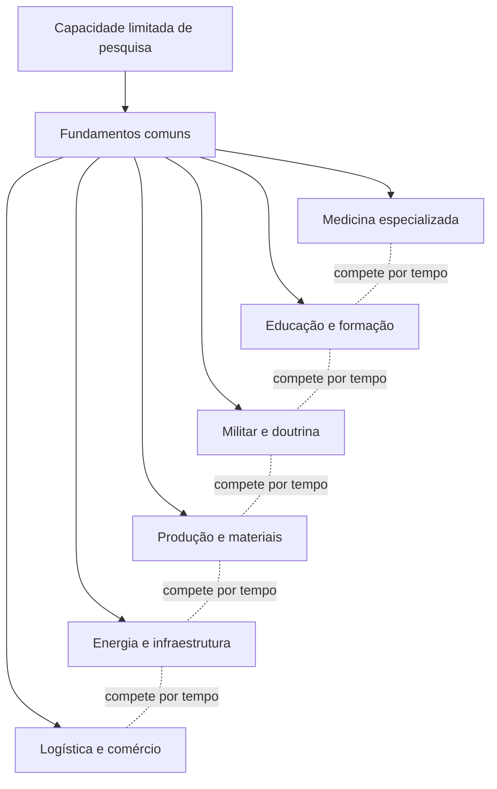
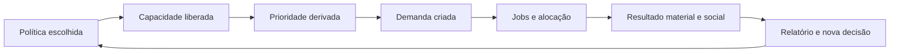
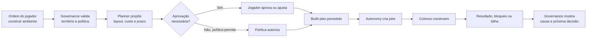
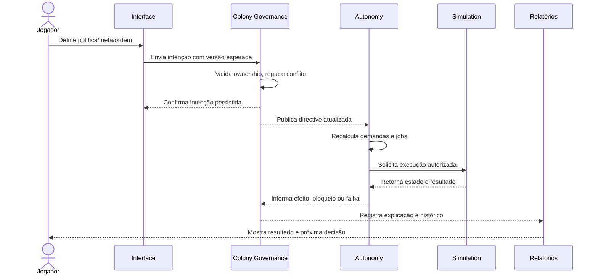
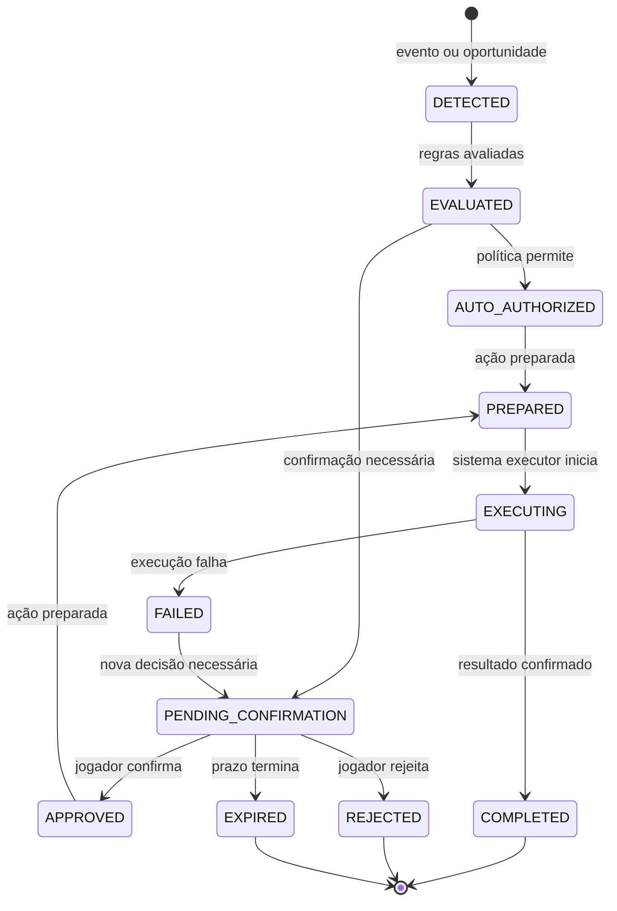
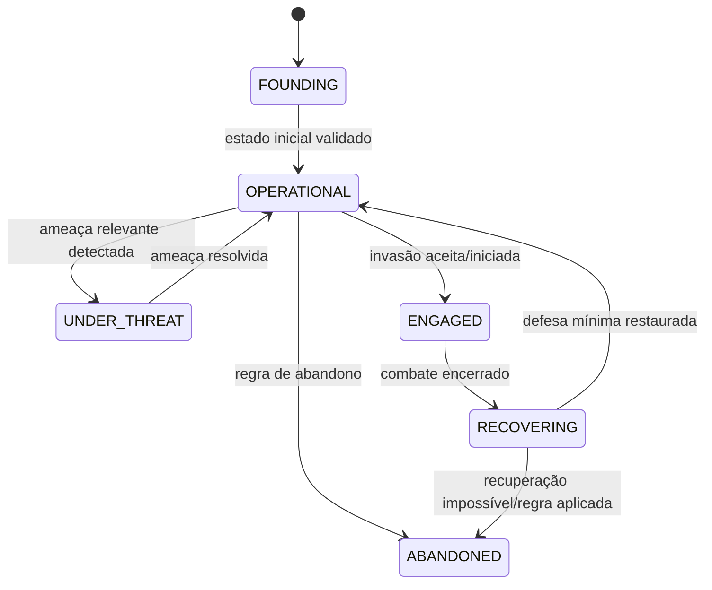

# Frontier — Macro System Design: Colony Governance

**Status:** rascunho para revisão humana  
**Versão:** v0.2  
**Escopo:** governança e intenção de uma única colônia  
**Fora do escopo:** execução de jobs, IA de colonos, produção, ledger, mercado, clãs e resolução detalhada de combate

## 1. Objetivo do sistema

Colony Governance é o sistema que transforma decisões do jogador em instruções duráveis para a colônia.

O catálogo transversal de setores, configurações e trade-offs está em [Policy Matrix](./policy-matrix.md).

O jogador não deve precisar escolher cada colono ou controlar cada deslocamento. Ele define intenção por meio de metas, políticas, ordens, planos e decisões críticas. As prioridades operacionais são derivadas dessas configurações; os sistemas autônomos usam o resultado para decidir como executar o trabalho.

O sistema precisa responder de forma clara:

- o que o jogador pediu;
- o que está ativo;
- o que está pendente de confirmação;
- o que a colônia está autorizada a fazer sozinha;
- o que está bloqueado e por quê;
- qual efeito a decisão teve no restante da colônia.

## 2. Princípio central

```text
Jogador define intenção
→ Governance valida e registra
→ Autonomy interpreta
→ colonos/infraestrutura executam
→ estado da colônia muda
→ Governance apresenta resultado e exceções
```

Colony Governance é autoridade sobre a **intenção configurada pelo jogador**, não sobre todo o estado operacional da colônia.

## 3. Boundary

### Dentro do boundary

- configuração da colônia;
- nome e identidade da colônia;
- prioridades;
- metas de estoque;
- políticas de operação;
- planos de construção e expansão;
- habilitação/desabilitação de infraestrutura;
- regras de segurança e disponibilidade para PvP;
- decisões críticas pendentes;
- histórico das decisões do jogador;
- preferências de relatório e alertas;
- autorização para a autonomia agir dentro de limites.

### Fora do boundary

- escolher o colono exato para cada job;
- calcular o caminho de transporte;
- consumir ou criar recursos diretamente;
- resolver necessidades individuais;
- executar receitas de produção;
- resolver o combate;
- liquidar pagamentos;
- alterar diretamente a posição física de um ativo;
- criar ou remover colonos por comando instantâneo.

Esses limites evitam transformar Governance em um “God System” que conhece e altera todos os detalhes do jogo.

## 4. Responsabilidades e ownership

| Estado ou decisão | Autoridade conceitual | Governança pode |
| --- | --- | --- |
| Intenção do jogador | Colony Governance | Criar, alterar, validar e versionar |
| Prioridade e meta | Colony Governance | Persistir e publicar para consumidores |
| Política da colônia | Colony Governance | Validar regras e ativar/desativar |
| Estado físico da colônia | World/Simulation | Observar; não sobrescrever diretamente |
| Necessidade do colono | Population | Receber impacto e informar Governance |
| Demanda e job | Autonomy | Interpretar intenção e executar |
| Estoque e localização | Inventory/Logistics | Reportar; reservar e mover |
| Estado de prédio | Infrastructure/Simulation | Reportar e alterar durante execução |
| Estado de combate | Combat Simulation | Reportar e resolver |
| Proteção PvP | Governance + regra do mundo | Solicitar/ativar conforme contrato definido |

A matriz acima é conceitual. A autoridade final de estado entre Governance, Simulation e Economy ainda deve ser confirmada no Macro System Design geral.

## 5. Modelo conceitual

### 5.1 Colony

Representa a unidade de governança do jogador.

Propriedades conceituais:

- `colonyId`;
- `ownerId`;
- `name`;
- `worldLocation`;
- `territory`;
- `populationCount`;
- `populationLimit`;
- `governanceVersion`;
- `lifecycleState`;
- `pvpState`;
- referências para políticas e metas ativas.

Regras já definidas:

- um jogador possui no máximo uma colônia;
- a colônia começa com 3 colonos;
- o limite absoluto de população é 100;
- prédios são limitados pelo espaço físico do território, não por um contador artificial fixo;
- a colônia persiste e continua operando offline.

### 5.2 Directive

Uma intenção persistida do jogador ou uma autorização formal para a autonomia.

Exemplos:

- “manter 50 unidades de comida”;
- “configurar a política de Segurança acima da Produção”;
- “manter a fábrica habilitada”;
- “preparar defesa contra ameaça identificada”;
- “aceitar este imigrante”;
- “desativar proteção PvP”.

Uma directive não é um job. Ela pode gerar, alterar ou cancelar várias demandas ao longo do tempo.

### 5.3 PriorityRule

Regra de prioridade derivada das políticas da colônia, da segurança, das necessidades e das ordens ativas. O jogador não cria uma fila de prioridade livre; ele escolhe políticas e parâmetros que fazem o sistema calcular a ordem adequada.

Uma prioridade derivada precisa ter:

- escopo;
- valor ou posição relativa;
- condições de ativação;
- duração ou validade;
- origem (jogador, política ou segurança);
- explicação visível.

Quando uma política muda, a alteração deve ser propagada para todos os colonos e entidades afetados. A Autonomy recalcula as prioridades e replaneja os jobs derivados; o jogador não precisa cancelar cada trabalho individualmente. Se a política de uma escola for removida ou trocada, a escola encerra ou reorganiza a formação, e professores e alunos deixam automaticamente aquelas tarefas.

Exemplo: o jogador não arrasta “tratar colono A” para o topo de uma lista. Ele configura a política de Saúde para priorizar colonos próprios em relação a pacientes externos; o sistema deriva a prioridade de cada atendimento, executa o tratamento automaticamente e explica a decisão.

### 5.4 StockGoal

Representa uma meta de quantidade para um recurso ou item.

Exemplos:

- manter comida acima de um limite;
- reservar materiais para uma construção;
- garantir remédios para condições de saúde;
- manter munição para defesa.

Uma meta gera demanda; ela não cria recursos instantaneamente.

### 5.5 Policy

Regra que limita ou orienta decisões autônomas. Políticas são a principal superfície de customização da colônia: duas colônias podem possuir os mesmos prédios e ainda operar de maneiras muito diferentes por causa das suas políticas.

Exemplos conceituais:

- segurança tem prioridade sobre lucro;
- não usar estoque seguro;
- não iniciar combate sem confirmação;
- aceitar ou rejeitar imigrantes;
- interromper produção quando o armazenamento atingir certo limite;
- manter uma reserva de emergência.

As políticas precisam ter limites explícitos. Uma política não pode autorizar uma ação proibida pelo estado do mundo ou por uma regra de segurança. Selecionar quais linhas de produção ficam disponíveis é uma política; iniciar cada receita é consequência automática de demandas, ordens, reservas e prioridades.

#### 5.5.1 Catálogo inicial de políticas

| Setor | O jogador configura | Consequência esperada |
| --- | --- | --- |
| Segurança | armamento, muros, prontidão, regras de engajamento e defesa | altera risco, consumo de materiais e resposta a ameaças |
| Alimentação | restrições alimentares, tipos de produção, conservação e reserva | altera saúde, satisfação, espaço, energia e consumo |
| Saúde | medicina, cirurgia, tratamento de doenças e prioridade médica | altera sobrevivência, disponibilidade de colonos e uso de remédios |
| Energia | fontes permitidas, produção, reserva e prioridade de consumo | altera custo, confiabilidade, apagões e produção |
| Produção | armas, roupas, armaduras, comida, medicina e materiais básicos | altera cadeias produtivas, capacidade e especialização |
| Descanso | tempo de trabalho, recreação, sono e tolerância à fadiga | altera produtividade, moral, saúde e segurança |
| Fauna | criação de gado, interação com fauna regional, abate, reprodução, alimentação e manejo | altera alimento, materiais, espaço, risco, trabalho e capacidades futuras |
| Comércio | produtos/serviços autorizados, preços, reservas e contrapartes | altera liquidez, estoques, risco e dependência externa |
| Educação | escola de formação, transmissão de skills e capacidade profissional escolhida | altera evolução dos colonos, pesquisa e disponibilidade de especialistas |

Cada setor deve possuir parâmetros com custo e efeito observáveis. “Produzir comida” não é uma única opção: tipo de alimento, conservação, prioridade, mão de obra, energia e estoque-alvo devem criar escolhas diferentes.

As prioridades podem ser configuradas dentro de uma política setorial e comparadas entre setores, sem permitir uma ordenação arbitrária de indivíduos ou jobs. A tabela abaixo contém exemplos de configurações possíveis, não uma hierarquia fixa imposta pelo sistema:

| Setor | Política de prioridade | Resultado possível |
| --- | --- | --- |
| Saúde | próprios colonos antes de pacientes externos | o sistema usa médicos e remédios primeiro na população da colônia |
| Saúde | emergência antes de rotina | condições graves interrompem atendimentos menos urgentes |
| Produção | consumo interno antes de exportação | a colônia repõe suas metas antes de vender excedentes |
| Energia | vida/sistema médico antes de indústria | déficit desliga consumidores menos prioritários segundo a configuração |
| Alimentação | população antes de comércio | alimentos necessários não são enviados para venda |
| Segurança | defesa da colônia antes de escolta | combatentes permanecem disponíveis para proteger o território |
| Descanso | recuperação de fadiga antes de horas extras | trabalho adicional pode ser priorizado se o jogador assumir esse risco |

Uma política pode definir ordem entre categorias, mas não deve criar microgerenciamento disfarçado. A escolha individual de cada executor continua pertencendo à Autonomy.

#### 5.5.2 Pesquisa como expansão de políticas e especialização

Pesquisa não deve apenas liberar prédios. Ela também pode liberar novas opções de política, maior precisão de controle, especializações ou automações mais avançadas.

O potencial de pesquisa é deliberadamente limitado. Será virtualmente impossível uma colônia pesquisar tudo em um horizonte relevante, não por falta de conteúdo, mas porque cada especialização demora e compete com as demais. Pesquisar medicina avançada significa deixar educação, militar, produção ou energia menos desenvolvidos naquele período.

O objetivo é criar custo de oportunidade real:

- uma colônia pode se especializar em medicina, mas depender de outra para armas;
- uma colônia militar pode ter ótima defesa, mas importar comida;
- uma colônia educacional pode formar especialistas, mas precisar de infraestrutura externa;
- uma colônia industrial pode produzir equipamentos, mas depender de tratamento e conhecimento de terceiros.

Essa limitação deve gerar interdependência econômica, contratos e alianças. Não deve existir uma rota simples para desbloquear tudo e depois manter todas as áreas no máximo.

Exemplos:

- saúde básica → tratamento geral;
- medicina avançada → cirurgia especializada e tratamento de condições específicas;
- conservação → novas regras de armazenamento e preservação;
- metalurgia → políticas de liga, qualidade e prioridade de materiais;
- engenharia energética → fontes, baterias e racionamento mais sofisticado;
- educação avançada → treinamento de skills e formação de especialistas;
- doutrina militar → novas regras de armamento e composição de `CombatEntity`.

Uma pesquisa desbloqueia uma **capacidade de política** para a colônia; isso não ensina automaticamente todos os colonos. O jogador define, pela política de Educação, qual capacidade profissional a colônia formará. A escola então organiza a formação de indivíduos compatíveis: o sistema escolhe professores e alunos, e não cria uma relação direta de controle entre os dois. Por exemplo, pesquisar Neurologia libera o campo, mas um médico precisa aprender neurologia em uma escola antes de aplicá-la. Para ensinar a capacidade, o professor precisa tê-la aprendido individualmente e possuir a skill de Ensino. Remover a política de formação cancela automaticamente a educação em andamento.



O grafo representa competição por capacidade e tempo, não necessariamente bloqueios permanentes. O conhecimento adquirido pela colônia é permanente e não é transferido diretamente por contratos ou comércio. A capacidade individual também permanece depois de aprendida, mas sua proficiência (`actualSkill`) pode diminuir quando a skill fica sem uso, como no RimWorld. O pico histórico (`maxSkillReached`) é preservado; Educação e prática recuperam a proficiência até esse pico 1,5× mais rápido que o aprendizado além dele. O limiar de inatividade e as velocidades variam por skill. Para transmitir uma capacidade, o professor precisa ter a pesquisa/capacidade aprendida e a skill de Ensino. A colônia pode trocar sua especialização ativa, mas a redistribuição tem custo e tempo de transição: a área antiga perde eficiência gradualmente, a nova começa com baixa eficiência e exige educação individual.

#### 5.5.3 Política como cadeia de consequências

Uma política só cumpre seu papel se atravessar os sistemas e produzir uma diferença observável na base:



Exemplos de customização real:

- **colônia agrícola:** alimentação e conservação recebem capacidade, energia e espaço; produção industrial e militar ficam limitadas;
- **colônia médica:** pesquisa, educação e tratamento de colonos próprios recebem prioridade; serviços externos só usam capacidade excedente;
- **colônia militar:** armamento, muros, prontidão e educação de combate recebem prioridade; comida e materiais podem depender de importação;
- **colônia industrial:** materiais, energia e produção recebem prioridade; saúde, descanso e defesa ainda impõem limites de segurança.

A política não deve alterar apenas uma tela. Ela deve afetar demandas, escolha de jobs, reservas, consumo, pesquisa, composição populacional e dependências comerciais.

### 5.6 ColonyOrder

Uma ordem é uma intenção operacional específica, diferente de uma política permanente.

- **Policy:** “nunca usar o estoque seguro para produção normal”;
- **Goal:** “manter 100 unidades de comida”;
- **Order:** “produzir 20 armaduras de qualidade mínima 2 até a data definida”;
- **Job:** “transportar 10 ferro do armazém A para a oficina B agora”.

Uma `ColonyOrder` pode solicitar produtos ou serviços dentro da própria colônia e, quando os mercados estiverem ativos, de NPCs ou de outras colônias.

Campos conceituais:

- produto ou serviço;
- quantidade e qualidade mínima;
- origem e destino;
- prazo;
- orçamento ou preço máximo;
- prioridade;
- substitutos permitidos;
- uso de estoque seguro permitido ou proibido;
- política de falha, cancelamento e expiração.

Isso permite criar ordens sobre comida, remédios, roupas, armaduras, reparos, transporte, tratamento médico, construção e contratos, sem transformar cada novo produto em uma regra especial de Governance.

### 5.7 PendingDecision

Decisão que a colônia detectou, preparou ou recomendou, mas não pode executar sem resposta do jogador.

Exemplos:

- aceitar um imigrante;
- declarar invasão;
- desativar proteção PvP;
- aceitar um contrato de colono;
- confirmar uma operação com perda potencial permanente.

Uma PendingDecision precisa informar urgência, prazo, consequências prováveis e o que ocorrerá se ficar sem resposta.

### 5.8 Formação da base e construção

A formação da base precisa preservar a autoria do jogador sem exigir que ele desenhe cada detalhe. A recomendação é um modelo híbrido com três níveis:

| Nível | O jogador faz | A colônia faz |
| --- | --- | --- |
| Planta/blueprint | Define posição, formato, área e prioridade | Valida espaço, materiais, acesso e execução |
| Ordem de ambiente | Pede “construir uma casa para 3 colonos” e define restrições | Propõe layout, calcula custo e apresenta preview |
| Política de expansão | Define regras como “priorizar abrigo e deixar corredor de expansão” | Sugere novos ambientes quando uma necessidade surgir |

**Recomendação para a v1:** o jogador aprova o blueprint ou a proposta de ambiente; a IA executa a construção, escolhe a ordem dos trabalhos e pode sugerir melhorias. Construção totalmente autônoma sem preview deve ser desbloqueada apenas quando houver confiança suficiente e uma política explícita.

Uma casa “inteligente” deve ser avaliada por restrições verificáveis, não por uma promessa vaga de inteligência. Exemplos:

- abriga a população prevista;
- possui acesso válido;
- respeita o espaço físico do território;
- não bloqueia rotas essenciais;
- considera energia, água, comida e saúde;
- permite expansão futura;
- respeita segurança, distância de ameaças e separação de áreas;
- informa custo, tempo e trade-offs antes da aprovação.



O planner de construção não deve escrever diretamente no estado físico. Ele produz uma proposta ou `BuildPlan`; Infrastructure e Autonomy validam recursos, reservas, caminho e execução.

## 6. Fluxo conceitual de uma decisão



Governance não deve esperar a conclusão de todo job para confirmar que uma intenção foi registrada. A confirmação da intenção e o resultado operacional são momentos diferentes.

## 7. Fluxo de decisão crítica



O estado `EXPIRED` não deve ter comportamento implícito. Cada tipo de decisão precisa definir se expirar significa rejeitar, manter a situação atual ou aplicar uma política segura.

## 8. Comandos conceituais

Os nomes abaixo são comandos de domínio, não endpoints de API.

| Comando | Origem | Resultado esperado | Classificação inicial |
| --- | --- | --- | --- |
| `CreateColony` | Jogador | Cria uma colônia inicial válida | Manual |
| `RenameColony` | Jogador | Altera identidade | Manual |
| `SetStockGoal` | Jogador | Cria/altera meta de estoque | Manual |
| `SetPolicy` | Jogador | Ativa ou altera uma política | Manual |
| `SetSectorPolicy` | Jogador | Altera parâmetros de Segurança, Alimentação, Saúde, Energia, Produção, Descanso, Fauna ou Comércio | Manual |
| `CreateColonyOrder` | Jogador | Solicita produto ou serviço com quantidade, prazo e restrições | Manual |
| `CancelColonyOrder` | Jogador | Cancela uma ordem ainda compatível com cancelamento | Manual |
| `EnableFacility` | Jogador | Autoriza operação de prédio | Manual |
| `DisableFacility` | Jogador | Suspende novos usos do prédio | Manual |
| `CreateBuildPlan` | Jogador | Registra intenção de construção | Híbrido |
| `CancelDirective` | Jogador | Cancela intenção compatível | Manual |
| `ApprovePendingDecision` | Jogador | Autoriza ação crítica | Crítico |
| `RejectPendingDecision` | Jogador | Impede ação crítica | Crítico |
| `ConfigureSecureStock` | Jogador | Define reserva protegida | Manual |
| `ConfigureDefenseDoctrine` | Jogador | Define orientação de defesa | Manual |
| `ConfigureFaunaPolicy` | Jogador | Define manejo de gado e interação com fauna regional | Manual |
| `ConfigureMedicalPolicy` | Jogador | Define regras de prioridade para medicina, cirurgia e tratamentos | Manual |
| `ConfigureEducationPolicy` | Jogador | Define treinamento, transmissão de skills e foco de formação | Manual |
| `SetWorkRestSchedule` | Jogador | Define trabalho, sono e recreação | Manual |
| `ConfigureConstructionPolicy` | Jogador | Define regras para propostas e expansão da base | Manual |
| `EnablePvpProtection` | Jogador/NPC | Ativa proteção conforme regra | Crítico |
| `DisablePvpProtection` | Jogador | Torna a colônia elegível ao PvP | Crítico |

## 9. Eventos conceituais

Eventos abaixo comunicam que algo aconteceu; não são comandos.

| Evento | Quando ocorre | Consumidores prováveis |
| --- | --- | --- |
| `ColonyCreated` | Colônia inicial validada | World, Population, UI |
| `DirectiveCreated` | Nova intenção persistida | Autonomy, Audit |
| `DirectiveChanged` | Intenção alterada | Autonomy, UI, Audit |
| `DirectiveCanceled` | Intenção cancelada | Autonomy, Inventory, Audit |
| `PriorityUpdated` | Ordem derivada de uma política ou regra de segurança mudou | Autonomy |
| `StockGoalUpdated` | Meta de estoque mudou | Demand, Autonomy |
| `PolicyActivated` | Política ficou ativa | Autonomy, Security |
| `PolicyDeactivated` | Política foi removida | Autonomy, Security |
| `SectorPolicyUpdated` | Parâmetros de um setor foram alterados | Autonomy, Production, Health, Defense, Energy |
| `ColonyOrderCreated` | Ordem de produto/serviço foi persistida | Demand, Autonomy, Market |
| `ColonyOrderChanged` | Ordem foi alterada | Demand, Autonomy, Market |
| `ColonyOrderCanceled` | Ordem foi cancelada | Demand, Autonomy, Inventory, Market |
| `PolicyCapabilityUnlocked` | Pesquisa liberou nova opção de política | Governance, UI |
| `BuildPlanProposed` | Planner sugeriu formação da base | Governance, UI |
| `BuildPlanApproved` | Jogador autorizou um layout | Autonomy, Infrastructure |
| `PendingDecisionCreated` | Confirmação passou a ser necessária | UI, Notification |
| `PendingDecisionResolved` | Jogador aprovou/rejeitou | Autonomy, Audit |
| `GovernanceVersionAdvanced` | Estado de intenção avançou | Qualquer consumidor de snapshot |
| `PvpProtectionChanged` | Proteção foi ativada/desativada | World, Defense, UI |
| `GovernanceExplanationRecorded` | Motivo de decisão foi registrado | UI, Audit, Support |

Os nomes são provisórios. O contrato final precisa definir versão, ordenação, idempotência e comportamento em caso de consumidor indisponível.

## 10. Invariantes preliminares

- apenas o owner autorizado pode alterar a governança da colônia;
- um jogador não pode criar uma segunda colônia;
- a população não pode ultrapassar 100 colonos;
- uma intenção inválida não pode ser persistida como ativa;
- uma directive cancelada não pode continuar gerando novos jobs sem uma nova autorização;
- uma decisão crítica não pode ser tratada como aprovada apenas porque expirou;
- o jogador não pode editar diretamente uma fila de prioridade de indivíduos ou jobs;
- toda prioridade operacional precisa ser derivável de uma política, necessidade, ordem ou regra de segurança;
- uma alteração de prioridade deve possuir versão e histórico;
- reenvio do mesmo comando não pode duplicar directive, meta ou autorização;
- uma `ColonyOrder` não pode ser tratada como um job até que suas pré-condições sejam satisfeitas;
- uma política desbloqueada por pesquisa não pode ser usada antes da capacidade estar disponível;
- alterar uma política deve deixar visível quais demandas e ordens podem ser afetadas;
- um `BuildPlan` aprovado não garante construção imediata: recursos, espaço, caminho e capacidade ainda precisam ser validados;
- desligar um prédio não deve apagar silenciosamente recursos já reservados;
- configurar estoque seguro não pode exceder os limites definidos pelo mundo;
- desativar proteção PvP deve produzir aviso e histórico;
- Governance não pode escrever diretamente no estado físico mantido por outro domínio.

## 11. Consistência e concorrência conceituais

### 11.1 Ordem por colônia

Alterações de governança devem ser ordenadas por colônia. Se o jogador enviar duas mudanças de política rapidamente, o sistema precisa aceitar uma ordem clara ou rejeitar a segunda por versão antiga.

### 11.2 Idempotência

Comandos do jogador devem possuir uma chave de requisição. Repetir `SetStockGoal` ou `ApprovePendingDecision` por timeout não pode produzir duas metas ou duas execuções.

### 11.3 Conflito com o mundo

Uma intenção pode ser válida quando criada e deixar de ser executável depois. Exemplo: o jogador habilita um prédio, mas ele está sem energia. Governance mantém a intenção; Autonomy/Infrastructure informa o bloqueio.

Governance não deve converter automaticamente “intenção bloqueada” em “intenção cancelada”. São estados diferentes e precisam de explicação.

### 11.4 Tempo real

O jogador deve ver alterações de governança e localização relevantes em tempo real. Isso não significa que todos os cálculos precisam ocorrer a cada frame; significa que a informação apresentada precisa indicar quando foi atualizada e não pode fingir que um estado antigo é atual.

## 12. Máquina de estados da colônia

Esta é uma proposta inicial, não a máquina final de combate ou simulação.



Pontos ainda abertos:

- se `UNDER_THREAT` for estado de governança ou apenas um alerta;
- se `ENGAGED` pertencer à colônia ou exclusivamente a Combat;
- quais transições são automáticas;
- se `ABANDONED` existe na v1;
- se a colônia pode voltar de `ABANDONED`.

## 13. Explicabilidade mínima

Toda mudança ou bloqueio relevante deve permitir responder:

1. qual intenção estava ativa;
2. qual regra ou política foi aplicada;
3. qual estado foi observado;
4. qual sistema recebeu a execução;
5. qual resultado ocorreu;
6. qual decisão o jogador pode tomar agora.

Exemplo:

```text
Meta: manter 50 comida
Estado: estoque atual 18 comida
Demanda: produzir 32 comida
Bloqueio: fazenda sem energia por 4m 12s
Alternativa: priorizar energia ou comprar no NPC
```

## 14. Questões para revisão humana

Estas são as decisões específicas de Colony Governance que precisam ser respondidas antes de fechar o macro design:

1. Os setores confirmados para políticas são Segurança, Alimentação, Saúde, Energia, Produção, Descanso, Fauna e Comércio. Quais são os parâmetros mínimos de cada setor na v1?
2. **Resolvido:** o jogador não cria prioridades livres. Ele configura políticas, e o sistema deriva as prioridades operacionais.
3. **Direção definida:** políticas podem conter prioridades por setor e contexto — por exemplo, Saúde prioriza colonos próprios antes de pacientes externos. Ainda falta definir se uma política também pode aplicar-se a um prédio, recurso ou ordem específica.
4. O jogador poderá assumir controle manual temporário de um colono ou apenas alterar a intenção da colônia? Essa decisão será tomada após o inventário completo de interações.
5. As ações críticas provisórias são invasão, desativação da proteção PvP, aceitação de imigrante, aceitação de contrato e saque. Alguma delas deve ser automática por política?
6. Quando uma meta de estoque entra em conflito com uma reserva de emergência ou com uma ordem de maior prioridade?
7. O que acontece quando uma decisão crítica expira sem resposta: rejeitar, manter estado atual ou aplicar política segura?
8. O jogador pode habilitar/desabilitar uma instalação enquanto há jobs e reservas ativos? Como as reservas serão liberadas?
9. A proteção PvP será tratada como uma política, um estado da colônia e um contrato NPC ao mesmo tempo? A proposta é usar os três conceitos com responsabilidades separadas.
10. Quais eventos precisam ser mostrados imediatamente e quais entram em resumo offline?
11. O jogador poderá ter múltiplos perfis de política para alternar ou apenas uma configuração ativa?
12. Qual parte da governança será editável em massa para respeitar o limite de 40 minutos por dia?
13. O modelo híbrido de construção — blueprint manual, proposta inteligente e política de expansão — está aprovado para a v1?
14. Quais capacidades de política devem ser liberadas por pesquisa em cada setor?
15. Quais produtos e serviços podem ser solicitados por `ColonyOrder` no primeiro ciclo e quais ficam para mercados futuros?

## 15. Critério de pronto para o próximo domínio

Colony Governance poderá ser considerado conceitualmente pronto quando houver acordo sobre:

- lista de interações manuais, automáticas, híbridas e críticas do primeiro ciclo;
- vocabulário de priorities, goals, policies e pending decisions;
- estados e transições da colônia que realmente pertencem a Governance;
- regras para cancelamento, expiração e intervenção;
- ownership entre Governance, Autonomy, Simulation, Inventory e Defense;
- explicações mínimas exibidas ao jogador;
- comportamento offline das decisões pendentes;
- invariantes de uma colônia por jogador e população máxima;
- contratos de eventos e comandos em nível conceitual.

Depois dessa revisão, o próximo domínio recomendado é **Autonomy**, porque ele consome as directives de Governance e as transforma em demandas e jobs.
