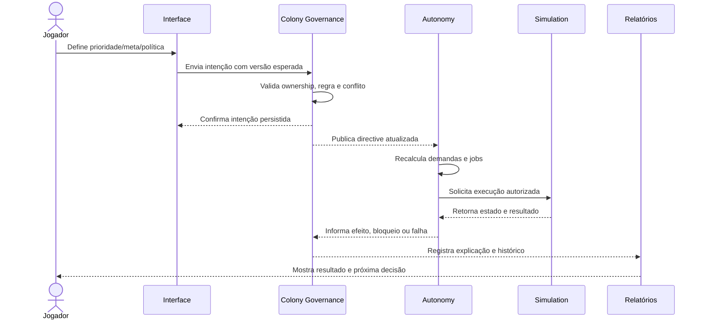
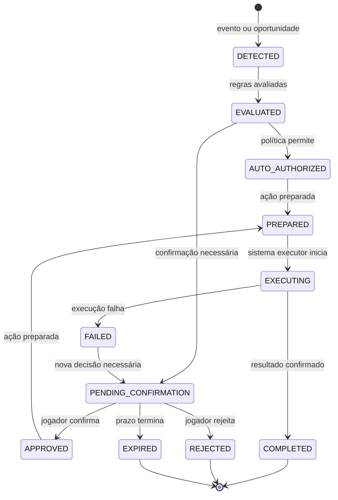
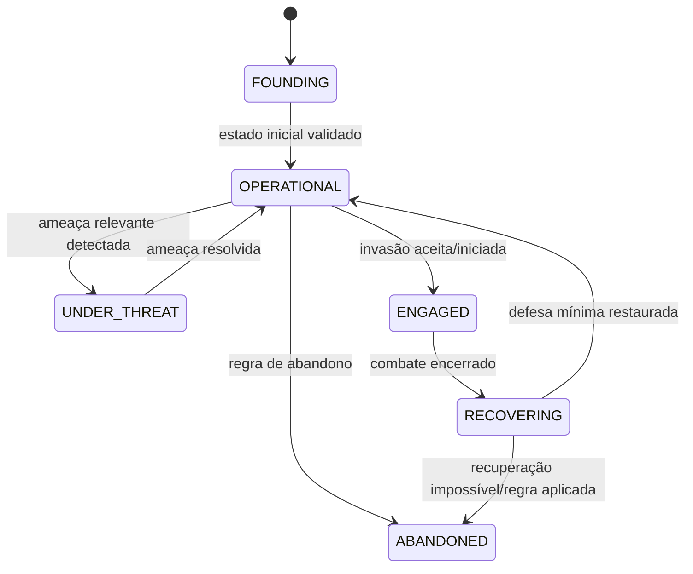

# Frontier — Macro System Design: Colony Governance

**Status:** rascunho para revisão humana  
**Versão:** v0.1  
**Escopo:** governança e intenção de uma única colônia  
**Fora do escopo:** execução de jobs, IA de colonos, produção, ledger, mercado, clãs e resolução detalhada de combate

## 1. Objetivo do sistema

Colony Governance é o sistema que transforma decisões do jogador em instruções duráveis para a colônia.

O jogador não deve precisar escolher cada colono ou controlar cada deslocamento. Ele define intenção por meio de prioridades, metas, políticas, planos e decisões críticas. Os sistemas autônomos usam essas intenções para decidir como executar o trabalho.

O sistema precisa responder de forma clara:

- o que o jogador pediu;
- o que está ativo;
- o que está pendente de confirmação;
- o que a colônia está autorizada a fazer sozinha;
- o que está bloqueado e por quê;
- qual efeito a decisão teve no restante da colônia.

## 2. Princípio central

```text
Jogador define intenção
→ Governance valida e registra
→ Autonomy interpreta
→ colonos/infraestrutura executam
→ estado da colônia muda
→ Governance apresenta resultado e exceções
```

Colony Governance é autoridade sobre a **intenção configurada pelo jogador**, não sobre todo o estado operacional da colônia.

## 3. Boundary

### Dentro do boundary

- configuração da colônia;
- nome e identidade da colônia;
- prioridades;
- metas de estoque;
- políticas de operação;
- planos de construção e expansão;
- habilitação/desabilitação de infraestrutura;
- regras de segurança e disponibilidade para PvP;
- decisões críticas pendentes;
- histórico das decisões do jogador;
- preferências de relatório e alertas;
- autorização para a autonomia agir dentro de limites.

### Fora do boundary

- escolher o colono exato para cada job;
- calcular o caminho de transporte;
- consumir ou criar recursos diretamente;
- resolver necessidades individuais;
- executar receitas de produção;
- resolver o combate;
- liquidar pagamentos;
- alterar diretamente a posição física de um ativo;
- criar ou remover colonos por comando instantâneo.

Esses limites evitam transformar Governance em um “God System” que conhece e altera todos os detalhes do jogo.

## 4. Responsabilidades e ownership

| Estado ou decisão | Autoridade conceitual | Governança pode |
| --- | --- | --- |
| Intenção do jogador | Colony Governance | Criar, alterar, validar e versionar |
| Prioridade e meta | Colony Governance | Persistir e publicar para consumidores |
| Política da colônia | Colony Governance | Validar regras e ativar/desativar |
| Estado físico da colônia | World/Simulation | Observar; não sobrescrever diretamente |
| Necessidade do colono | Population | Receber impacto e informar Governance |
| Demanda e job | Autonomy | Interpretar intenção e executar |
| Estoque e localização | Inventory/Logistics | Reportar; reservar e mover |
| Estado de prédio | Infrastructure/Simulation | Reportar e alterar durante execução |
| Estado de combate | Combat Simulation | Reportar e resolver |
| Proteção PvP | Governance + regra do mundo | Solicitar/ativar conforme contrato definido |

A matriz acima é conceitual. A autoridade final de estado entre Governance, Simulation e Economy ainda deve ser confirmada no Macro System Design geral.

## 5. Modelo conceitual

### 5.1 Colony

Representa a unidade de governança do jogador.

Propriedades conceituais:

- `colonyId`;
- `ownerId`;
- `name`;
- `worldLocation`;
- `territory`;
- `populationCount`;
- `populationLimit`;
- `governanceVersion`;
- `lifecycleState`;
- `pvpState`;
- referências para políticas e metas ativas.

Regras já definidas:

- um jogador possui no máximo uma colônia;
- a colônia começa com 3 colonos;
- o limite absoluto de população é 100;
- prédios são limitados pelo espaço físico do território, não por um contador artificial fixo;
- a colônia persiste e continua operando offline.

### 5.2 Directive

Uma intenção persistida do jogador ou uma autorização formal para a autonomia.

Exemplos:

- “manter 50 unidades de comida”;
- “priorizar segurança acima de produção”;
- “manter a fábrica habilitada”;
- “preparar defesa contra ameaça identificada”;
- “aceitar este imigrante”;
- “desativar proteção PvP”.

Uma directive não é um job. Ela pode gerar, alterar ou cancelar várias demandas ao longo do tempo.

### 5.3 PriorityRule

Define como a colônia ordena intenções concorrentes.

Uma prioridade precisa ter:

- escopo;
- valor ou posição relativa;
- condições de ativação;
- duração ou validade;
- origem (jogador, política ou segurança);
- explicação visível.

### 5.4 StockGoal

Representa uma meta de quantidade para um recurso ou item.

Exemplos:

- manter comida acima de um limite;
- reservar materiais para uma construção;
- garantir remédios para condições de saúde;
- manter munição para defesa.

Uma meta gera demanda; ela não cria recursos instantaneamente.

### 5.5 Policy

Regra que limita ou orienta decisões autônomas.

Exemplos conceituais:

- segurança tem prioridade sobre lucro;
- não usar estoque seguro;
- não iniciar combate sem confirmação;
- aceitar ou rejeitar imigrantes;
- interromper produção quando o armazenamento atingir certo limite;
- manter uma reserva de emergência.

As políticas precisam ter limites explícitos. Uma política não pode autorizar uma ação proibida pelo estado do mundo ou por uma regra de segurança.

### 5.6 PendingDecision

Decisão que a colônia detectou, preparou ou recomendou, mas não pode executar sem resposta do jogador.

Exemplos:

- aceitar um imigrante;
- declarar invasão;
- desativar proteção PvP;
- aceitar um contrato de colono;
- confirmar uma operação com perda potencial permanente.

Uma PendingDecision precisa informar urgência, prazo, consequências prováveis e o que ocorrerá se ficar sem resposta.

## 6. Fluxo conceitual de uma decisão



Governance não deve esperar a conclusão de todo job para confirmar que uma intenção foi registrada. A confirmação da intenção e o resultado operacional são momentos diferentes.

## 7. Fluxo de decisão crítica



O estado `EXPIRED` não deve ter comportamento implícito. Cada tipo de decisão precisa definir se expirar significa rejeitar, manter a situação atual ou aplicar uma política segura.

## 8. Comandos conceituais

Os nomes abaixo são comandos de domínio, não endpoints de API.

| Comando | Origem | Resultado esperado | Classificação inicial |
| --- | --- | --- | --- |
| `CreateColony` | Jogador | Cria uma colônia inicial válida | Manual |
| `RenameColony` | Jogador | Altera identidade | Manual |
| `SetPriority` | Jogador | Atualiza ordenação de intenção | Manual |
| `SetStockGoal` | Jogador | Cria/altera meta de estoque | Manual |
| `SetPolicy` | Jogador | Ativa ou altera uma política | Manual |
| `EnableFacility` | Jogador | Autoriza operação de prédio | Manual |
| `DisableFacility` | Jogador | Suspende novos usos do prédio | Manual |
| `CreateBuildPlan` | Jogador | Registra intenção de construção | Híbrido |
| `CancelDirective` | Jogador | Cancela intenção compatível | Manual |
| `ApprovePendingDecision` | Jogador | Autoriza ação crítica | Crítico |
| `RejectPendingDecision` | Jogador | Impede ação crítica | Crítico |
| `ConfigureSecureStock` | Jogador | Define reserva protegida | Manual |
| `ConfigureDefenseDoctrine` | Jogador | Define orientação de defesa | Manual |
| `EnablePvpProtection` | Jogador/NPC | Ativa proteção conforme regra | Crítico |
| `DisablePvpProtection` | Jogador | Torna a colônia elegível ao PvP | Crítico |

## 9. Eventos conceituais

Eventos abaixo comunicam que algo aconteceu; não são comandos.

| Evento | Quando ocorre | Consumidores prováveis |
| --- | --- | --- |
| `ColonyCreated` | Colônia inicial validada | World, Population, UI |
| `DirectiveCreated` | Nova intenção persistida | Autonomy, Audit |
| `DirectiveChanged` | Intenção alterada | Autonomy, UI, Audit |
| `DirectiveCanceled` | Intenção cancelada | Autonomy, Inventory, Audit |
| `PriorityUpdated` | Ordem de prioridade mudou | Autonomy |
| `StockGoalUpdated` | Meta de estoque mudou | Demand, Autonomy |
| `PolicyActivated` | Política ficou ativa | Autonomy, Security |
| `PolicyDeactivated` | Política foi removida | Autonomy, Security |
| `PendingDecisionCreated` | Confirmação passou a ser necessária | UI, Notification |
| `PendingDecisionResolved` | Jogador aprovou/rejeitou | Autonomy, Audit |
| `GovernanceVersionAdvanced` | Estado de intenção avançou | Qualquer consumidor de snapshot |
| `PvpProtectionChanged` | Proteção foi ativada/desativada | World, Defense, UI |
| `GovernanceExplanationRecorded` | Motivo de decisão foi registrado | UI, Audit, Support |

Os nomes são provisórios. O contrato final precisa definir versão, ordenação, idempotência e comportamento em caso de consumidor indisponível.

## 10. Invariantes preliminares

- apenas o owner autorizado pode alterar a governança da colônia;
- um jogador não pode criar uma segunda colônia;
- a população não pode ultrapassar 100 colonos;
- uma intenção inválida não pode ser persistida como ativa;
- uma directive cancelada não pode continuar gerando novos jobs sem uma nova autorização;
- uma decisão crítica não pode ser tratada como aprovada apenas porque expirou;
- uma alteração de prioridade deve possuir versão e histórico;
- reenvio do mesmo comando não pode duplicar directive, meta ou autorização;
- desligar um prédio não deve apagar silenciosamente recursos já reservados;
- configurar estoque seguro não pode exceder os limites definidos pelo mundo;
- desativar proteção PvP deve produzir aviso e histórico;
- Governance não pode escrever diretamente no estado físico mantido por outro domínio.

## 11. Consistência e concorrência conceituais

### 11.1 Ordem por colônia

Alterações de governança devem ser ordenadas por colônia. Se o jogador enviar duas mudanças de prioridade rapidamente, o sistema precisa aceitar uma ordem clara ou rejeitar a segunda por versão antiga.

### 11.2 Idempotência

Comandos do jogador devem possuir uma chave de requisição. Repetir `SetStockGoal` ou `ApprovePendingDecision` por timeout não pode produzir duas metas ou duas execuções.

### 11.3 Conflito com o mundo

Uma intenção pode ser válida quando criada e deixar de ser executável depois. Exemplo: o jogador habilita um prédio, mas ele está sem energia. Governance mantém a intenção; Autonomy/Infrastructure informa o bloqueio.

Governance não deve converter automaticamente “intenção bloqueada” em “intenção cancelada”. São estados diferentes e precisam de explicação.

### 11.4 Tempo real

O jogador deve ver alterações de governança e localização relevantes em tempo real. Isso não significa que todos os cálculos precisam ocorrer a cada frame; significa que a informação apresentada precisa indicar quando foi atualizada e não pode fingir que um estado antigo é atual.

## 12. Máquina de estados da colônia

Esta é uma proposta inicial, não a máquina final de combate ou simulação.



Pontos ainda abertos:

- se `UNDER_THREAT` for estado de governança ou apenas um alerta;
- se `ENGAGED` pertencer à colônia ou exclusivamente a Combat;
- quais transições são automáticas;
- se `ABANDONED` existe na v1;
- se a colônia pode voltar de `ABANDONED`.

## 13. Explicabilidade mínima

Toda mudança ou bloqueio relevante deve permitir responder:

1. qual intenção estava ativa;
2. qual regra ou política foi aplicada;
3. qual estado foi observado;
4. qual sistema recebeu a execução;
5. qual resultado ocorreu;
6. qual decisão o jogador pode tomar agora.

Exemplo:

```text
Meta: manter 50 comida
Estado: estoque atual 18 comida
Demanda: produzir 32 comida
Bloqueio: fazenda sem energia por 4m 12s
Alternativa: priorizar energia ou comprar no NPC
```

## 14. Questões para revisão humana

Estas são as decisões específicas de Colony Governance que precisam ser respondidas antes de fechar o macro design:

1. Quais políticas existem no primeiro ciclo? Segurança, comida, saúde, energia, produção e descanso são suficientes?
2. O jogador pode criar prioridades livres ou escolhe uma lista de prioridades predefinida?
3. Uma prioridade é global, por sistema ou por prédio/recurso?
4. O jogador pode assumir controle manual temporário de um colono ou apenas alterar a intenção da colônia?
5. Quais ações sempre exigem confirmação: invasão, desativar proteção, aceitar imigrante, contrato e saque?
6. Quando uma meta de estoque entra em conflito com uma reserva de emergência?
7. O que acontece quando uma decisão crítica expira sem resposta?
8. O jogador pode habilitar/desabilitar uma instalação enquanto há jobs e reservas ativos?
9. A proteção PvP é uma política da colônia ou um estado do mundo com contrato NPC?
10. Quais eventos precisam ser mostrados imediatamente e quais entram em resumo offline?
11. O jogador pode ter múltiplos perfis de política para alternar ou apenas uma configuração ativa?
12. Qual parte da governança será editável em massa para respeitar o limite de 40 minutos por dia?

## 15. Critério de pronto para o próximo domínio

Colony Governance poderá ser considerado conceitualmente pronto quando houver acordo sobre:

- lista de interações manuais, automáticas, híbridas e críticas do primeiro ciclo;
- vocabulário de priorities, goals, policies e pending decisions;
- estados e transições da colônia que realmente pertencem a Governance;
- regras para cancelamento, expiração e intervenção;
- ownership entre Governance, Autonomy, Simulation, Inventory e Defense;
- explicações mínimas exibidas ao jogador;
- comportamento offline das decisões pendentes;
- invariantes de uma colônia por jogador e população máxima;
- contratos de eventos e comandos em nível conceitual.

Depois dessa revisão, o próximo domínio recomendado é **Autonomy**, porque ele consome as directives de Governance e as transforma em demandas e jobs.
