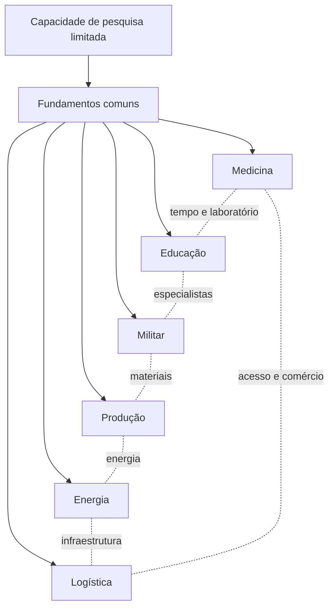

# Frontier — Policy Matrix

**Status:** rascunho para revisão humana  
**Versão:** v0.1  
**Objetivo:** mapear todas as políticas setoriais antes de detalhar e implementar cada domínio  
**Relação:** complementa [Colony Governance](./colony-governance.md)

## 1. Objetivo da matriz

Frontier terá um framework comum de políticas, mas cada setor possuirá regras próprias. A matriz existe para evitar dois problemas:

1. criar cada sistema isoladamente e descobrir tarde demais que eles competem pelos mesmos recursos;
2. criar um sistema genérico demais e apagar as características únicas de Saúde, Militar, Produção, Educação e outros setores.

A regra de design é:

> **estrutura comum, comportamento específico.**

O jogador configura políticas. O sistema deriva prioridades, demandas e jobs a partir delas. O jogador não edita livremente uma fila de prioridade de indivíduos ou tarefas.

## 2. Contrato comum de uma política

Toda política setorial deve responder às mesmas perguntas básicas:

| Elemento | Pergunta |
| --- | --- |
| Objetivo | Que problema ou capacidade este setor resolve? |
| Escopo | A política vale para a colônia, setor, prédio, recurso, população ou ordem? |
| Configuração | Quais escolhas o jogador pode fazer? |
| Capacidade | O que precisa ser pesquisado ou construído antes? |
| Entradas | Quais recursos, skills, tempo e infraestrutura são necessários? |
| Prioridade derivada | Como a política altera a ordem de demandas e jobs? |
| Saídas | Que produtos, serviços, condições ou informações são gerados? |
| Trade-offs | O que melhora e o que fica mais caro, lento ou vulnerável? |
| Dependências | Quais outros setores precisam cooperar? |
| Falhas | O que acontece quando faltam recursos, pessoas ou tempo? |
| Offline | O que continua acontecendo sem o jogador? |
| Pesquisa | Quais especializações e automações podem ser desbloqueadas? |
| Observabilidade | Como o jogador entende o efeito da política? |

Esse contrato comum é documental. Ele não obriga todos os setores a usarem a mesma fórmula ou a mesma implementação.

## 3. Pipeline comum


O pipeline é comum, mas a forma como cada setor calcula capacidade, risco, qualidade, urgência e resultado pode ser única.

## 4. Matriz de políticas

### 4.1 Visão geral

| Setor | Configurações principais | Prioridades derivadas | Saídas | Característica única | Setor-piloto |
| --- | --- | --- | --- | --- | --- |
| Segurança | armamento, muros, prontidão, doutrina, regras de engajamento | defesa da colônia, ameaça, escolta e segurança de ativos | defesa, combate, alertas | decisões críticas e risco permanente | Piloto 3 |
| Alimentação | dietas, tipos de produção, conservação, reservas | alimentação da população, preservação e comércio | comida, resíduos, saúde | perecibilidade e necessidade contínua | Posterior |
| Saúde | medicina, cirurgia, doenças, pacientes próprios/externos | emergência, colonos próprios, rotina, contratos | tratamento, recuperação, risco de morte | urgência clínica e mortalidade | Piloto 2 |
| Energia | fontes, produção, reserva, consumidores | vida, saúde, segurança, produção e conforto | energia, calor, apagões | rede compartilhada e cascata de falhas | Piloto 1 |
| Produção | armas, roupas, armaduras, comida, medicina, materiais | consumo interno, ordens, exportação, pesquisa | produtos, subprodutos, resíduos | cadeias e gargalos | Piloto 1 |
| Descanso | trabalho, sono, recreação, fadiga | recuperação, produtividade e segurança | disponibilidade e saúde | efeito acumulado no agente | Posterior |
| Fauna | criação, alimentação, reprodução, abate, manejo e interação com fauna regional | alimento, materiais, espaço, risco e oportunidades | comida, materiais, animais e capacidades futuras | seres vivos, comportamento regional e capacidades variáveis | Posterior |
| Comércio | produtos, serviços, preços, reservas, contrapartes | consumo interno, liquidez e margem | transações e compromissos | dependência externa e risco econômico | Posterior |
| Educação | treinamento, transmissão de skills, foco de formação | skills críticas, pesquisa e sucessão | especialistas e progresso | desenvolvimento lento e irreversível parcial | Piloto 1 |

### 4.2 Segurança

**Objetivo:** proteger pessoas, infraestrutura, estoque e rotas sem consumir todos os recursos da colônia.

**Configurações possíveis:**

- armamento mínimo e máximo;
- política de muros, portas, zonas e acessos;
- prontidão normal, elevada ou de crise;
- regras de engajamento;
- prioridade entre defesa da colônia, escolta, fauna e invasão;
- reserva de combatentes e equipamentos;
- perda aceitável antes de retirada.

**Trade-offs:** mais prontidão aumenta segurança, mas reduz descanso, produção e disponibilidade de colonos. Mais muros aumentam proteção, mas consomem espaço, materiais e manutenção.

**Dependências:** produção, energia, pesquisa, saúde, logística e combate.

### 4.3 Alimentação

**Objetivo:** garantir alimentação suficiente, segura e compatível com as preferências e condições da população.

**Configurações possíveis:**

- tipos de alimento permitidos;
- restrições alimentares;
- prioridade entre fazenda, hidroponia, criação e processamento;
- conservação e descarte;
- reserva mínima e reserva de crise;
- comida para consumo interno versus exportação.

**Trade-offs:** alimentos mais sofisticados podem aumentar saúde e moral, mas exigem mais espaço, energia, pesquisa ou logística. Conservação reduz perdas, mas consome infraestrutura.

**Dependências:** fauna, produção, energia, saúde, armazenamento e pesquisa.

### 4.4 Saúde

**Objetivo:** manter colonos vivos e funcionais, definindo quem recebe quais tratamentos, quando e com quais recursos.

**Configurações possíveis:**

- tratamento geral e primeiros socorros;
- cirurgia;
- doenças e condições persistentes;
- prioridade para colonos próprios ou pacientes externos;
- emergência antes de rotina;
- uso de medicamentos raros;
- isolamento e prevenção;
- capacidade mínima de atendimento;
- aceitação de contratos médicos externos.

**Trade-offs:** atender pacientes externos pode gerar créditos e reputação, mas consome médicos, remédios e tempo que poderiam proteger a própria população.

**Dependências:** educação, produção de medicina, energia, alimentação, descanso e pesquisa.

### 4.5 Energia

**Objetivo:** produzir e distribuir energia com prioridades explícitas quando a capacidade for insuficiente.

**Configurações possíveis:**

- fontes de geração;
- reserva e baterias;
- consumidores críticos;
- tolerância a apagão;
- produção energética para estoque ou demanda imediata;
- desligamento automático de setores;
- risco ambiental e manutenção.

**Trade-offs:** fontes baratas podem ser instáveis ou poluentes; fontes confiáveis podem consumir pesquisa, território e materiais raros.

**Dependências:** produção, infraestrutura, saúde, alimentação, pesquisa e armazenamento.

### 4.6 Produção

**Objetivo:** transformar recursos, tempo e capacidade em produtos úteis para a colônia ou para ordens externas.

**Configurações possíveis:**

- armas;
- roupas e armaduras;
- comida;
- medicina;
- ferro, madeira, água, cobre e componentes;
- qualidade mínima;
- consumo interno antes de exportação;
- produção contínua, por meta ou por ordem;
- reaproveitamento, resíduos e manutenção.

**Trade-offs:** especializar fábricas aumenta eficiência, mas cria dependência. Qualidade alta consome mais tempo, energia e materiais.

**Dependências:** energia, logística, pesquisa, educação, saúde, alimentação e comércio.

### 4.7 Descanso

**Objetivo:** definir como a colônia troca tempo de trabalho por recuperação, moral e segurança.

**Configurações possíveis:**

- tempo mínimo de sono;
- tempo de recreação;
- horas extras permitidas;
- recuperação após combate;
- trabalho prioritário em crise;
- flexibilidade por skill ou profissão.

**Trade-offs:** mais horas de trabalho aceleram produção no curto prazo, mas reduzem saúde, moral, precisão e disponibilidade futura.

**Dependências:** saúde, produção, segurança, educação e população.

### 4.8 Fauna

**Objetivo:** transformar animais de criação e fauna regional em partes administráveis da economia, do ecossistema e, quando desbloqueado, da defesa da colônia. Nem todo animal regional é gado, e o sistema não deve assumir que uma espécie é permanentemente impossível de domesticar ou treinar.

**Configurações possíveis:**

- criação e reprodução;
- alimentação;
- abate;
- uso para transporte ou materiais;
- manejo de fauna selvagem;
- presença de espécies por região;
- risco, comportamento e distância da base;
- capacidades graduais de criação, domesticação, treinamento, transporte e combate;
- tolerância a risco e proximidade da base;
- reserva de animais reprodutores.

Cada espécie deve possuir capacidades configuráveis por dados. Um valor `0` significa que a capacidade não está disponível no conteúdo/regras atuais; não significa uma impossibilidade permanente. Por exemplo, um urso regional pode começar com `domesticação = 0` e `treinamento de infantaria = 0`, enquanto uma atualização futura pode habilitar essas capacidades por pesquisa, evento ou novo conteúdo.

**Trade-offs:** gado gera alimento e materiais, mas consome espaço, comida, água e trabalho. Fauna regional pode ser ameaça, recurso, animal domesticável ou unidade de combate futura.

**Dependências:** alimentação, saúde, produção, território e pesquisa.

### 4.9 Comércio

**Objetivo:** permitir ordens de produtos e serviços sem transformar a colônia em uma sequência de compras manuais.

**Configurações possíveis:**

- produtos e serviços autorizados;
- preço máximo e mínimo;
- contrapartes permitidas;
- estoque protegido;
- uso de NPC como último recurso;
- margem mínima;
- consumo interno antes de exportação;
- aceitação de contratos.

**Trade-offs:** vender cedo gera créditos, mas pode causar escassez interna. Comprar de NPC mantém a operação, mas é economicamente pior que negociar com jogadores.

**Dependências:** produção, logística, finance, saúde, educação e pesquisa.

### 4.10 Educação

**Objetivo:** formar especialistas, transmitir skills e tornar a especialização da colônia sustentável.

**Configurações possíveis:**

- skills prioritárias;
- formação de novos colonos;
- treinamento durante o trabalho;
- professores e mentores;
- educação militar, médica, industrial ou científica;
- tempo de educação versus produção imediata;
- retenção e sucessão de conhecimento.

**Trade-offs:** educar reduz produção no curto prazo, mas aumenta capacidade futura. Uma colônia sem educação pode depender de contratos ou imigração para manter especialistas.

**Dependências:** saúde, descanso, pesquisa, população, produção e contratos.

## 5. Pesquisa e especialização

O sistema de pesquisa deve tornar essas políticas profundamente diferentes entre colônias.

### Princípios confirmados

- pesquisar tudo deve ser virtualmente impossível em um horizonte relevante;
- especializações demoram e competem pela capacidade de pesquisa;
- medicina, educação, militar, produção, energia e logística não podem ser maximizadas simultaneamente com facilidade;
- pesquisa desbloqueia capacidades de política, e não apenas prédios;
- uma capacidade pesquisada não é ativada automaticamente;
- não deve existir uma configuração universalmente ótima;
- especialização cria dependência e espaço para comércio, contratos e alianças.



As linhas representam dependência e competição, não necessariamente bloqueios permanentes. A forma final de exclusividade, recuperação e transferência de conhecimento pertence ao sistema de Research.

## 6. O que é comum e o que deve continuar específico

**Decisão de pesquisa:** o conhecimento adquirido é permanente e não é transferido diretamente por contratos ou comércio. Permanecem em aberto apenas as regras de recuperação de skills e de redistribuição da capacidade ativa ao trocar de especialização.

### Deve ser comum

- identidade da política;
- escopo;
- versionamento;
- pesquisa necessária;
- cálculo de prioridade derivada;
- geração de demandas;
- criação de ordens;
- autorização, cancelamento e expiração;
- observabilidade;
- histórico;
- tratamento offline.

### Deve continuar específico

- como Saúde avalia urgência clínica;
- como Energia calcula redes e cascatas;
- como Produção calcula receitas e qualidade;
- como Segurança calcula risco e doutrina;
- como Educação transmite skill;
- como Fauna calcula crescimento e manejo;
- como Alimentação calcula deterioração;
- como Descanso calcula fadiga;
- como Comércio calcula preço e exposição.

Não devemos criar um único algoritmo genérico para todos esses problemas.

## 7. Setores-piloto

### Piloto 1 — Produção + Energia + Educação

Escolhido porque testa:

- políticas setoriais;
- cadeias produtivas;
- recursos físicos e infraestrutura;
- dependência entre produção e energia;
- educação como capacidade de longo prazo;
- pesquisa especializada;
- consequência de longo prazo;
- interação entre tempo, descanso e produção.

Saúde entra depois do fluxo inicial do core loop. Ela continua sendo importante para o produto, mas não é necessária para validar a primeira cadeia jogável de produção, infraestrutura, energia e capacitação.

### Piloto 2 — Saúde

Escolhido porque testa:

- prioridade por contexto;
- pacientes próprios versus externos;
- pesquisa especializada;
- tratamento, recuperação e mortalidade;
- serviços médicos com pacientes externos reais.

### Piloto 3 — Segurança

Escolhido porque testa:

- decisões críticas;
- políticas offline;
- doutrina;
- entidades de combate compostas;
- risco permanente;
- trade-off entre prontidão, descanso e produção.

## 8. Ordem recomendada de trabalho

```text
Policy Matrix
→ Produção + Energia + Educação
→ Saúde
→ Segurança
→ revisar abstrações comuns
→ detalhar Alimentação, Descanso e Fauna
→ detalhar Comércio e contratos
→ escolher o primeiro vertical slice de implementação
```

Cada piloto deve ser especificado com o template comum, mas preservar suas regras únicas.

## 9. Questões abertas

1. **Resolvido:** no máximo 5 parâmetros principais por setor entram na v1; detalhes avançados podem ser liberados por pesquisa.
2. **Resolvido:** cada colônia possui uma fila única e apenas uma pesquisa ativa por vez; não há pesquisas paralelas na v1.
3. **Resolvido:** o conhecimento adquirido é permanente. Ainda pode ser necessário decidir como a colônia redistribui sua capacidade ativa ao trocar de especialização.
4. **Em aberto:** educação pode recuperar uma skill perdida ou apenas formar novas capacidades? A regra ainda precisa de uma definição mais concreta.
5. **Resolvido:** a pesquisa em si não é transferível por contratos ou comércio; cada colônia desenvolve seu próprio conhecimento.
6. **Resolvido:** o primeiro ciclo prioriza Produção, Energia e Educação. Saúde entra depois do fluxo inicial do core loop.
7. **Resolvido:** quando o mercado de serviços médicos e educacionais existir, ele exige pacientes e estudantes externos reais, não apenas demanda abstrata.
8. **Resolvido:** nenhuma política central depende de semanas de tempo real. Consequências podem ser imediatas ou ocorrer em horas/dias de jogo; por exemplo, uma construção pode durar aproximadamente 5 horas no jogo.

## 10. Critério de pronto

A Policy Matrix estará pronta para guiar os próximos designs quando:

- todos os setores tiverem objetivo, configurações, dependências e trade-offs descritos;
- o framework comum não estiver escondendo regras específicas;
- os pilotos Saúde/Educação, Produção/Energia e Segurança tiverem fronteiras claras;
- as consequências da pesquisa limitada estiverem refletidas nos sistemas;
- cada política puder gerar demandas, ordens e jobs sem editar prioridades manualmente;
- o primeiro vertical slice puder ser escolhido sem decisões arquiteturais críticas abertas.
