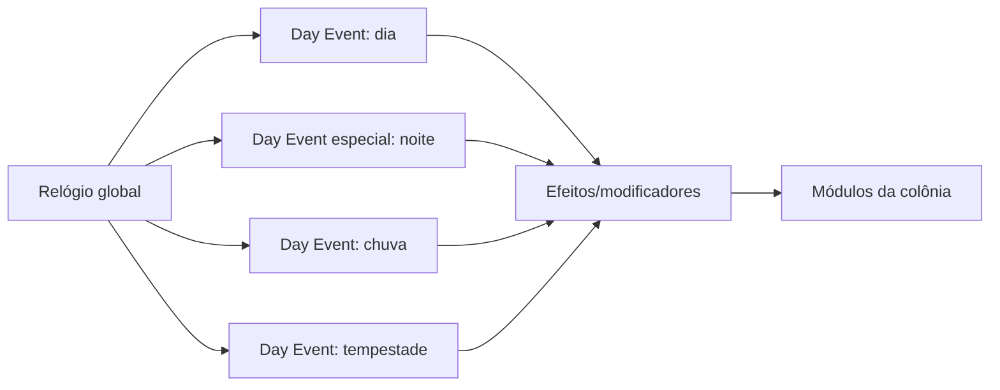
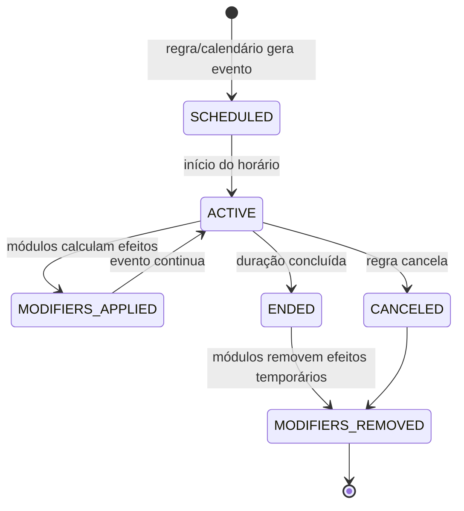

# Macro System Design — World/Time

## 1. Objetivo

World/Time fornece o relógio global, o ciclo de dia/noite e os eventos ambientais que alteram as condições de todas as colônias. O sistema não deve conter a lógica interna de Produção, Saúde, Fauna ou Segurança; ele publica estado temporal e efeitos que cada módulo interpreta.

## 2. Escala temporal aprovada

- o relógio é contínuo e global;
- 1 dia real equivale a 4 dias de jogo;
- 1 dia de jogo possui 24 horas de jogo e dura 6 horas reais;
- 1 hora real equivale a 4 horas de jogo;
- a velocidade é fixa, sem pause ou aceleração por jogador;
- todas as colônias compartilham o mesmo horário de jogo;
- não existem fusos horários na simulação;
- ações usam durações em horas/dias de jogo e são convertidas pela escala global.

## 3. Dia/noite como Day Event especial

Dia e noite são estados alternados e obrigatórios do relógio global. A noite é um **Day Event especial** porque sempre ocorre como parte do ciclo, enquanto chuva, tempestade e outros eventos podem ocorrer segundo suas próprias regras.



Todos os eventos temporais usam o mesmo horário global. Portanto, quando o mundo entra na noite, todas as colônias entram na noite simultaneamente. Na v1, noite, chuva e tempestade são eventos globais e afetam todas as colônias; variantes regionais ou locais ficam disponíveis para uma versão futura.

## 4. Day Event modular

Um Day Event representa uma condição do mundo com início, duração, intensidade, escopo e efeitos declarados. Ele não chama diretamente “o sistema de produção” ou “o sistema de fauna”; cada módulo possui um adaptador que converte o evento em consequências próprias.

| Campo | Função |
| --- | --- |
| `eventId` | identifica a ocorrência no histórico |
| `eventType` | noite, chuva, tempestade ou outro tipo de evento |
| `scope` | define quais colônias recebem o evento; o ciclo dia/noite é global |
| `startedAt` / `endsAt` | delimita a duração em tempo de jogo |
| `intensity` | permite variações do mesmo evento |
| `modifiers` | lista de efeitos que módulos podem interpretar |
| `source` | registra a causa, calendário ou regra que gerou o evento |
| `status` | ativo, encerrado, cancelado ou substituído |

O evento publica modificadores, por exemplo:

```text
Night:
  lighting = reduced
  solar_generation = reduced
  fauna_activity = nocturnal_rules
  security_risk = night_profile

Storm:
  production_speed = reduced
  solar_generation = interrupted
  travel_risk = increased
  fauna_activity = shelter_profile
  security_visibility = reduced
```

Esses valores são exemplos de contrato, não os números finais de balanceamento.

## 5. Módulos afetados

Cada módulo decide como interpretar os modificadores, mantendo suas próprias regras:

| Módulo | Possíveis efeitos de Day Events |
| --- | --- |
| Produção | velocidade de produção, disponibilidade de máquinas e risco de falha |
| Descanso | qualidade do descanso, fadiga e janelas de trabalho |
| Iluminação | visibilidade, áreas operacionais e necessidade de luz artificial |
| Energia | geração solar, consumo de iluminação e estabilidade da rede |
| Fauna | atividade, abrigo, comportamento, risco e oportunidades |
| Segurança | visibilidade, prontidão, detecção e perfil de risco |
| Plantio | crescimento, irrigação, exposição e janela de cultivo |
| Monstros | possibilidade de spawn, tipos, frequência e agressividade |
| Logística | velocidade, risco e acessibilidade de rotas |

Um evento pode afetar vários módulos ao mesmo tempo, mas cada efeito precisa ser explicado no módulo que o aplica.

## 6. Ciclo de vida de um evento



A entrada ou saída de um evento recalcula apenas as entidades e sistemas afetados. A mudança não deve exigir que o jogador reorganize manualmente cada colono.

## 7. Observabilidade

O jogador deve conseguir ver:

- qual Day Event está ativo;
- quando começou e quando terminará;
- quais colônias ou regiões são afetadas;
- quais módulos receberam modificadores;
- como cada modificador alterou produção, descanso, energia, fauna, segurança, plantio ou monstros;
- quais jobs foram bloqueados ou replanejados por causa do evento.

Eventos e efeitos entram no histórico e nos relatórios offline. Um evento global deve produzir uma explicação por colônia, porque o efeito final pode variar conforme infraestrutura, política e recursos locais.

## 8. Questões seguintes

- quantas horas de jogo correspondem ao período de dia e ao período de noite;
- quais efeitos mínimos da noite entram na primeira versão;
- quais eventos climáticos existem na v1 e qual é sua frequência;
- como introduzir variantes regionais ou locais de chuva e tempestade em uma versão futura;
- como estações alteram a geração e a intensidade de Day Events;
- como o sistema limita combinações simultâneas de eventos;
- quais modificadores podem ser empilhados e quais substituem outro evento;
- como processos biológicos interpretam clima e ciclo de dia/noite.

O princípio central permanece: World/Time publica condições temporais; os módulos transformam essas condições em consequências específicas.
